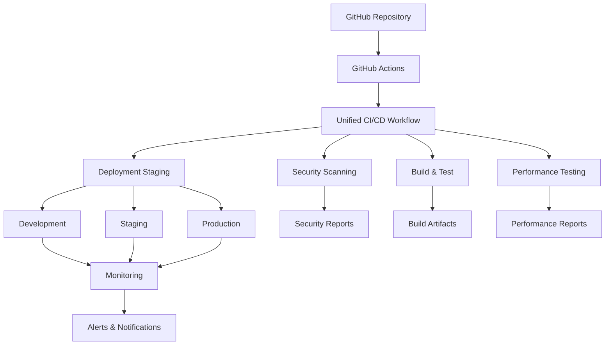

# Unified CI/CD Pipeline

A comprehensive, enterprise-grade CI/CD pipeline that consolidates multiple workflows into a single, efficient, and secure deployment system.

## 🚀 Overview

This unified CI/CD pipeline addresses the complexity and duplication found in traditional multi-workflow approaches by providing:

- **Single Workflow Architecture**: One GitHub Actions workflow handles all deployment scenarios
- **Standardized Security Scanning**: Consistent security checks across all environments
- **OIDC-based Authentication**: Secure, keyless authentication to cloud providers
- **Environment Protection**: Proper gating and approval processes for production
- **Intelligent Caching**: Optimized caching strategies for faster builds
- **Comprehensive Rollback**: Automated rollback mechanisms with health checks
- **Deployment Staging**: Proper staging with validation gates

## 📋 Table of Contents

- [Features](#features)
- [Architecture](#architecture)
- [Server Setup](#server-setup)
- [Quick Start](#quick-start)
- [Configuration](#configuration)
- [Usage](#usage)
- [Security](#security)
- [Monitoring](#monitoring)
- [Troubleshooting](#troubleshooting)
- [Contributing](#contributing)

## ✨ Features

### Core Capabilities
- **Multi-Environment Support**: Development, Staging, and Production environments
- **Container Security**: Vulnerability scanning with Trivy and Grype
- **Code Security**: Static analysis with Semgrep and secret scanning with TruffleHog
- **Performance Testing**: Load testing with K6 and performance monitoring
- **Infrastructure as Code**: Terraform integration with validation
- **Compliance Reporting**: Automated compliance checks and reporting

### Advanced Features
- **Smart Caching**: Multi-layer caching for dependencies, builds, and Docker layers
- **Progressive Deployment**: Blue-green and canary deployment strategies
- **Automated Rollback**: Health-check based automatic rollback
- **Real-time Monitoring**: Integrated monitoring and alerting
- **Backup & Restore**: Configuration and deployment state backup
- **OIDC Authentication**: Secure, keyless cloud provider authentication

## 🚀 Server Setup

### FastAPI Server

The project includes a FastAPI server that provides API endpoints for the ISA agentic system.

#### Prerequisites
- Python 3.8+
- pip
- Virtual environment (recommended)

#### Installation
```bash
# Clone the repository
git clone <repository-url>
cd isa-project

# Create virtual environment
python -m venv venv
source venv/bin/activate  # On Windows: venv\Scripts\activate

# Install dependencies
pip install -r requirements.txt
```

#### Environment Configuration
Create a `.env` file in the project root:
```bash
# Server Configuration
HOST=0.0.0.0
PORT=8001
DEBUG=true

# Database Configuration
DATABASE_URL=sqlite:///./isa.db

# Security
SECRET_KEY=your-secret-key-here
```

#### Running the Server
```bash
# Start the FastAPI server with Socket.io support
python -m uvicorn src.api_server:socket_app --host 0.0.0.0 --port 8001 --log-level info

# Server will be available at: http://localhost:8001
```

#### API Documentation
Once running, access the interactive API documentation at:
- Swagger UI: http://localhost:8001/docs
- ReDoc: http://localhost:8001/redoc

#### Health Check
Test the server health:
```bash
curl http://localhost:8001/health
```

### Recent Server Fixes (2025-09-16)
✅ **HTTPS redirect middleware**: Fixed 307 redirects and SSL errors in browsers
✅ **Environment variables**: Added dotenv loading for configuration
✅ **Import errors**: Resolved RateLimiter and Form imports from FastAPI
✅ **Endpoint parameters**: Fixed change-password endpoint parameter issues
✅ **App structure**: Cleaned up FastAPI app structure and Socket.io integration
✅ **Server status**: Now running successfully on http://localhost:8001

### Known Issues and Current Limitations

#### Current Working Components
- ✅ **Server Startup**: FastAPI server runs successfully on http://localhost:8001
- ✅ **Socket.io Chat System**: 100% functional (22/22 tests passed) - production-ready
- ✅ **Database Connectivity**: Functional with health monitoring
- ✅ **Basic Authentication**: Registration working
- ✅ **Security Headers & CORS**: Properly configured
- ✅ **Basic API Endpoints**: Health and registration endpoints operational

#### Known Issues
- ❌ **Authentication Login Endpoint**: Failing due to log_auth_event signature mismatch
- ❌ **GS1 Integration Endpoints**: Not implemented (imports commented out)
- ❌ **Compliance Workflow Endpoints**: Not implemented (imports commented out)
- ❌ **LLM/Agent Backend Integration**: Issues with async/await patterns and JSON serialization
- ❌ **System Monitoring Permissions**: psutil access denied for health metrics collection
- ❌ **Integration Features**: Some features not fully implemented

#### Current System Status
- **Server**: Runs successfully but with some endpoint limitations
- **Chat System**: Fully operational and production-ready
- **Backend Compliance Assistant**: Has integration issues requiring fixes
- **Database & Monitoring**: Functional but monitoring has permission issues
- **Overall**: Core functionality working, advanced features need completion

### System Capabilities and Limitations Summary

#### ✅ Production-Ready Components
- **FastAPI Server**: Successfully runs on http://localhost:8001 with proper configuration
- **Socket.io Chat System**: 100% functional (22/22 tests passed) - fully operational for real-time communication
- **Database Connectivity**: Working with health monitoring capabilities
- **Basic Authentication**: User registration functional
- **Security Infrastructure**: CORS and security headers properly configured
- **API Health Endpoints**: Basic monitoring and health checks operational

#### ⚠️ Partially Functional Components
- **Authentication System**: Registration works, login has signature mismatch issues
- **System Monitoring**: Database and basic monitoring functional, but psutil permissions denied
- **API Endpoints**: Core endpoints work, but some advanced features incomplete

#### ❌ Non-Functional Components (Require Implementation)
- **GS1 Integration Endpoints**: Imports commented out, not implemented
- **Compliance Workflow Endpoints**: Imports commented out, not implemented
- **LLM/Agent Backend Integration**: Async/await and JSON serialization issues
- **Advanced Integration Features**: Multiple features not fully implemented

#### 🚀 Next Priority Fixes
1. Fix authentication login endpoint (log_auth_event signature)
2. Implement GS1 integration endpoints
3. Implement compliance workflow endpoints
4. Resolve LLM/agent backend async issues
5. Fix system monitoring permissions
6. Complete remaining integration features

#### 📊 Overall System Health
- **Stability**: High (server runs reliably)
- **Functionality**: Medium (core features work, advanced features pending)
- **Testing Coverage**: Good (chat system fully tested)
- **Production Readiness**: Partial (core operational, advanced features need completion)

## 🏗️ Architecture

### High-Level Architecture



### Component Architecture

The unified pipeline consists of several key components:

1. **Unified Workflow** (`.github/workflows/unified-cicd.yml`)
2. **Configuration Management** (`config/` directory)
3. **Security Scanning** (`scripts/security-scanning.sh`)
4. **Performance Testing** (`scripts/performance-testing.sh`)
5. **Deployment Management** (`scripts/deployment-staging.sh`)
6. **Rollback Mechanisms** (`scripts/rollback-deployment.sh`)
7. **Monitoring & Alerting** (`scripts/monitoring.sh`)

## 🚀 Quick Start

### Prerequisites

- GitHub repository with Actions enabled
- Docker Hub account (or other container registry)
- Cloud provider account (AWS, Azure, or GCP)
- Basic understanding of GitHub Actions and Docker

### Installation

1. **Clone the repository** (or copy the files to your project):
   ```bash
   git clone <your-repo-url>
   cd your-project
   ```

2. **Run the setup script**:
   ```bash
   ./scripts/setup-unified-cicd.sh
   ```

3. **Configure your environment**:
   ```bash
   # Edit the main configuration
   nano config/unified-cicd.conf
   
   # Configure environment-specific settings
   nano config/environments/production.conf
   ```

4. **Set up GitHub secrets** (see [Configuration](#configuration) section)

5. **Validate the setup**:
   ```bash
   ./scripts/validate-unified-cicd.sh
   ```

6. **Run your first deployment**:
   ```bash
   ./scripts/unified-cicd-pipeline.sh deploy development
   ```

## ⚙️ Configuration

### Main Configuration (`config/unified-cicd.conf`)

```bash
# Project Configuration
PROJECT_NAME="my-app"
PROJECT_VERSION="1.0.0"
DOCKER_REGISTRY="docker.io"
DOCKER_USERNAME="your-username"

# Environment Configuration
ENVIRONMENTS=("development" "staging" "production")
DEFAULT_ENVIRONMENT="development"

# Security Configuration
SECURITY_SCAN_ENABLED=true
VULNERABILITY_THRESHOLD="HIGH"
COMPLIANCE_CHECKS_ENABLED=true

# Performance Configuration
PERFORMANCE_TEST_ENABLED=true
LOAD_TEST_DURATION="5m"
LOAD_TEST_VUS=100

# Deployment Configuration
DEPLOYMENT_STRATEGY="blue-green"
ROLLBACK_ENABLED=true
HEALTH_CHECK_ENABLED=true

# Monitoring Configuration
MONITORING_ENABLED=true
ALERTING_ENABLED=true
SLACK_WEBHOOK_URL=""  # Set via GitHub secret
```

### Environment-Specific Configuration

Each environment has its own configuration file in `config/environments/`:

- `development.conf` - Development environment settings
- `staging.conf` - Staging environment settings  
- `production.conf` - Production environment settings

### GitHub Secrets

Configure the following secrets in your GitHub repository:

#### Required Secrets
- `DOCKER_USERNAME` - Docker Hub username
- `DOCKER_PASSWORD` - Docker Hub password or token
- `SLACK_WEBHOOK_URL` - Slack webhook for notifications (optional)

#### Cloud Provider Secrets (choose one)

**AWS:**
- `AWS_ROLE_ARN` - IAM role for OIDC authentication
- `AWS_REGION` - AWS region for deployment

**Azure:**
- `AZURE_CLIENT_ID` - Azure service principal client ID
- `AZURE_TENANT_ID` - Azure tenant ID
- `AZURE_SUBSCRIPTION_ID` - Azure subscription ID

**GCP:**
- `GCP_WORKLOAD_IDENTITY_PROVIDER` - Workload identity provider
- `GCP_SERVICE_ACCOUNT` - Service account email

## 🎯 Usage

### Command Line Interface

The unified pipeline provides a comprehensive CLI:

```bash
# Deploy to development environment
./scripts/unified-cicd-pipeline.sh deploy development

# Deploy to staging with specific version
./scripts/unified-cicd-pipeline.sh deploy staging --version v1.2.3

# Deploy to production with approval
./scripts/unified-cicd-pipeline.sh deploy production --require-approval

# Run security scanning only
./scripts/unified-cicd-pipeline.sh security-scan

# Run performance testing
./scripts/unified-cicd-pipeline.sh performance-test

# Rollback deployment
./scripts/unified-cicd-pipeline.sh rollback production --to-version v1.2.2

# Backup configuration
./scripts/unified-cicd-pipeline.sh backup-config

# Get help
./scripts/unified-cicd-pipeline.sh --help
```

### GitHub Actions Integration

The pipeline automatically triggers on:

- **Push to main branch**: Deploys to staging
- **Pull requests**: Runs security scanning and testing
- **Manual workflow dispatch**: Deploy to any environment
- **Scheduled runs**: Nightly security scans

### Manual Triggers

You can manually trigger the workflow from the GitHub Actions tab:

1. Go to Actions → Unified CI/CD Pipeline
2. Click "Run workflow"
3. Select the environment and options
4. Click "Run workflow"

## 🔒 Security

### Security Scanning

The pipeline includes comprehensive security scanning:

1. **Container Vulnerability Scanning** (Trivy, Grype)
2. **Static Code Analysis** (Semgrep)
3. **Secret Detection** (TruffleHog)
4. **Dependency Scanning** (built into package managers)
5. **Infrastructure Scanning** (Checkov for Terraform)

### OIDC Authentication

The pipeline uses OIDC for secure authentication to cloud providers:

- **No long-lived credentials** stored in GitHub
- **Temporary tokens** with limited scope and duration
- **Auditable access** through cloud provider logs

### Environment Protection

Production deployments require:
- **Manual approval** from designated reviewers
- **Passing security scans** with no critical vulnerabilities
- **Successful staging deployment** validation
- **Health check validation** before traffic switch

## 📊 Monitoring

### Built-in Monitoring

The pipeline includes comprehensive monitoring:

- **Deployment Status**: Real-time deployment progress
- **Security Reports**: Vulnerability and compliance reports
- **Performance Metrics**: Load test results and performance trends
- **Health Checks**: Application and infrastructure health
- **Cost Tracking**: Resource usage and cost analysis

### Alerting

Configure alerts for:
- **Deployment failures**
- **Security vulnerabilities** above threshold
- **Performance degradation**
- **Infrastructure issues**
- **Cost overruns**

### Dashboards

Access pre-built dashboards:
- **Deployment Dashboard**: Deployment history and success rates
- **Security Dashboard**: Vulnerability trends and compliance status
- **Performance Dashboard**: Application performance metrics
- **Infrastructure Dashboard**: Resource utilization and health

## 🔧 Troubleshooting

### Common Issues

#### 1. Docker Build Failures
```bash
# Check Docker daemon
docker info

# Check Dockerfile syntax
docker build --no-cache .

# Check available disk space
df -h
```

#### 2. Security Scan Failures
```bash
# Run security scan manually
./scripts/security-scanning.sh --verbose

# Check security tool versions
trivy --version
grype --version
semgrep --version
```

#### 3. Deployment Failures
```bash
# Check deployment logs
tail -f logs/deployment.log

# Validate configuration
./scripts/validate-unified-cicd.sh

# Test connectivity to cloud provider
./scripts/unified-cicd-pipeline.sh --dry-run
```

#### 4. Performance Test Failures
```bash
# Run performance test manually
./scripts/performance-testing.sh --debug

# Check K6 installation
k6 version

# Review performance test configuration
cat config/performance/performance.conf
```

### Debug Mode

Enable debug mode for detailed logging:
```bash
export DEBUG=true
./scripts/unified-cicd-pipeline.sh deploy development
```

### Support

For issues and questions:
1. Check the [troubleshooting guide](docs/troubleshooting.md)
2. Review the [FAQ](docs/faq.md)
3. Open an issue in the repository
4. Check the logs in `logs/` directory

## 🤝 Contributing

We welcome contributions! Please see our [Contributing Guide](CONTRIBUTING.md) for details.

### Development Setup

1. Fork the repository
2. Create a feature branch
3. Make your changes
4. Run tests: `./scripts/validate-unified-cicd.sh`
5. Submit a pull request

### Code Style

- Follow shell scripting best practices
- Use shellcheck for linting
- Include comprehensive comments
- Update documentation for changes

## 📄 License

This project is licensed under the MIT License - see the [LICENSE](LICENSE) file for details.

## 🙏 Acknowledgments

- GitHub Actions team for the excellent CI/CD platform
- Security tool maintainers (Trivy, Grype, Semgrep, TruffleHog)
- Performance testing tools (K6)
- Cloud providers for OIDC support

## 📚 Additional Resources

- [Architecture Documentation](docs/unified-cicd-architecture.md)
- [Security Best Practices](docs/security-best-practices.md)
- [Performance Optimization](docs/performance-optimization.md)
- [Cloud Provider Setup](docs/cloud-provider-setup.md)
- [Migration Guide](docs/migration-guide.md)

---

**Happy Deploying!** 🚀

For more information, visit our [documentation](docs/) or [open an issue](https://github.com/your-repo/issues).