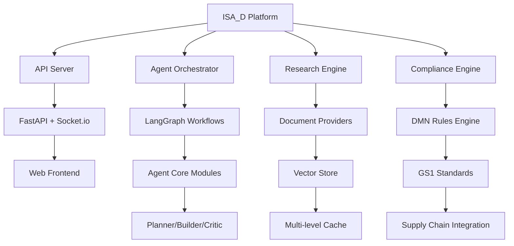

# ISA_D - Intelligent Standards Assistant

An intelligent agentic system for GS1 standards compliance, supply chain management, and automated research workflows.

## 🚀 Overview

ISA_D (Intelligent Standards Assistant) is a comprehensive platform that leverages AI agents to automate and enhance standards-based processes. The system provides:

- **Intelligent Research**: Automated research and knowledge extraction from standards documents
- **Compliance Automation**: GS1 and regulatory compliance checking and workflows
- **Supply Chain Integration**: End-to-end traceability and compliance verification
- **Agent Orchestration**: Modular agent system with specialized roles (planner, builder, critic)
- **Real-time Communication**: WebSocket-based chat and collaboration features
- **Extensible Architecture**: Plugin-based system for custom integrations

## 📋 Key Components

### Core Systems
- **Agent Core** (`src/agent_core/`): Modular agent architecture with typed interfaces
- **Orchestrator** (`src/orchestrator/`): Graph-based workflow orchestration
- **Research Engine** (`src/docs_provider/`): Document processing and knowledge extraction
- **Compliance Tools** (`src/dmn/`): Decision model and notation for compliance rules
- **LLM Integration** (`src/llm/`): Multi-provider LLM runtime with caching

### Infrastructure
- **API Server** (`src/api_server.py`): FastAPI server with Socket.io support
- **Frontend** (`frontend/`): Web interface for user interaction
- **Data Layer** (`data/`): Research ledgers, ingestion manifests, and knowledge bases
- **Scripts** (`scripts/`): Automation and utility scripts
- **Documentation** (`docs/`): Comprehensive project documentation

### Specialized Modules
- **GS1 Integration** (`src/gs1_*`): GS1 standards parsing and validation
- **Geospatial** (`src/geospatial/`): Location-based compliance and risk assessment
- **Privacy Preserving AI** (`src/privacy_preserving_ai/`): Federated learning and encryption
- **Vector Store** (`src/cache/`): Multi-level caching and vector storage

## 🏗️ Architecture



## 🚀 Quick Start

### Prerequisites
- Python 3.8+
- Node.js 16+ (for frontend)
- Docker (optional, for containerized deployment)

### Installation

1. **Clone the repository**:
   ```bash
   git clone <repository-url>
   cd isa_d
   ```

2. **Create virtual environment**:
   ```bash
   python -m venv venv
   source venv/bin/activate  # On Windows: venv\Scripts\activate
   ```

3. **Install dependencies**:
   ```bash
   pip install -r requirements.txt
   ```

4. **Configure environment**:
   ```bash
   cp .env.example .env
   # Edit .env with your API keys and configuration
   ```

### Environment Configuration

Create a `.env` file with required variables:

```bash
# Server Configuration
HOST=0.0.0.0
PORT=8001
DEBUG=true

# Database
DATABASE_URL=sqlite:///./isa.db

# LLM API Keys (choose providers)
OPENROUTER_API_KEY=your-openrouter-key
OPENAI_API_KEY=your-openai-key
ANTHROPIC_API_KEY=your-anthropic-key

# Security
SECRET_KEY=your-secret-key-here
```

**Security Note**: Never commit real API keys to version control. Use environment variables or secure secret management.

### Running the System

1. **Start the API server**:
   ```bash
   python -m uvicorn src.api_server:socket_app --host 0.0.0.0 --port 8001 --log-level info
   ```

2. **Access the application**:
   - API Documentation: http://localhost:8001/docs
   - Health Check: http://localhost:8001/health
   - Frontend: http://localhost:8001 (if frontend is served)

## 🎯 Core Workflows

### Research and Knowledge Extraction
- Automated PDF and document processing
- Standards research with provenance tracking
- Knowledge base construction and querying

### Compliance Automation
- GS1 standards validation
- Regulatory compliance checking
- Supply chain traceability verification

### Agent Orchestration
- Multi-agent collaboration
- Workflow planning and execution
- Quality gates and validation

## 📊 Monitoring and Health

The system includes comprehensive monitoring:

- **Health Checks**: System and component health monitoring
- **Performance Metrics**: Response times and resource usage
- **Audit Logging**: Comprehensive activity logging
- **Error Tracking**: Structured error reporting and recovery

## 🔧 Development

### Project Structure
```
isa_d/
├── src/                    # Core source code
│   ├── agent_core/        # Agent architecture
│   ├── orchestrator/      # Workflow orchestration
│   ├── docs_provider/     # Document processing
│   └── ...
├── docs/                  # Documentation
├── scripts/               # Utility scripts
├── data/                  # Data files and manifests
├── frontend/              # Web interface
├── helm/                  # Kubernetes deployment
└── tests/                 # Test suites
```

### Key Development Commands
```bash
# Run tests
pytest

# Lint code
ruff check .

# Format code
black .

# Generate documentation
sphinx-build docs/ docs/_build/html/
```

## 🤝 Contributing

We welcome contributions! Please see [CONTRIBUTING.md](CONTRIBUTING.md) for guidelines.

### Development Setup
1. Fork the repository
2. Create a feature branch
3. Make changes with tests
4. Submit a pull request

## 📄 License

This project is licensed under the MIT License - see [LICENSE](LICENSE) for details.

## 🙏 Acknowledgments

- GS1 community for standards development
- Open source AI and ML communities
- Contributors and maintainers

---

**Happy Automating!** 🤖

For more information, see the [documentation](docs/) or [open an issue](https://github.com/your-repo/issues).