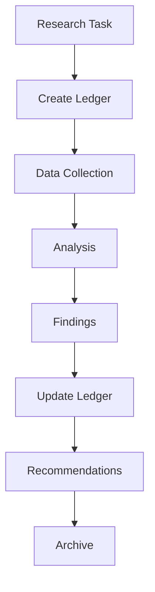
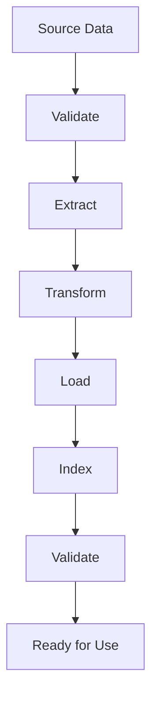

# ISA_D Data Directory

This directory contains data files, research ledgers, ingestion manifests, and knowledge bases for the ISA_D platform.

## 📁 Structure Overview

```
data/
├── data_catalog.yaml              # Data catalog definition
├── research_ledger_template.yaml  # Research tracking template
├── ingestion_manifests/           # Data ingestion configurations
│   ├── isa_docs_v1_manifest.yaml
│   └── isa_goals_pdfs_manifest.yaml
└── [additional data files]
```

## 📊 Data Types

### Research Data

| File Type | Purpose | Format |
|-----------|---------|--------|
| Research Ledgers | Track research activities | YAML |
| POC Results | Proof of concept outcomes | JSON/YAML |
| Evaluation Data | Performance metrics | CSV/JSON |
| Knowledge Bases | Extracted knowledge | JSON/Graph |

### Configuration Data

| File Type | Purpose | Format |
|-----------|---------|--------|
| Ingestion Manifests | Data pipeline configs | YAML |
| Data Catalogs | Data asset inventory | YAML |
| Schema Definitions | Data structure specs | JSON/YAML |
| Mapping Rules | Data transformation | YAML |

### Operational Data

| File Type | Purpose | Format |
|-----------|---------|--------|
| Audit Logs | System activity | JSON |
| Performance Metrics | System performance | JSON/CSV |
| Error Logs | Error tracking | JSON |
| Backup Data | System backups | Various |

## 🔧 Key Components

### Data Catalog (`data_catalog.yaml`)

Central registry of all data assets:

```yaml
# data_catalog.yaml
version: "1.0"
data_assets:
  research_ledgers:
    type: "research"
    format: "yaml"
    schema: "research_ledger_schema.json"
    location: "data/research_ledgers/"
    description: "Research activity tracking"

  knowledge_base:
    type: "knowledge"
    format: "json"
    schema: "knowledge_schema.json"
    location: "data/knowledge/"
    description: "Extracted knowledge from documents"

  compliance_rules:
    type: "rules"
    format: "yaml"
    schema: "rule_schema.json"
    location: "data/rules/"
    description: "Compliance and validation rules"
```

### Research Ledger Template (`research_ledger_template.yaml`)

Standardized template for research tracking:

```yaml
# research_ledger_template.yaml
research_id: "R-001"
title: "GS1 Standards Analysis"
status: "active"
created: "2025-01-01T00:00:00Z"
updated: "2025-01-01T00:00:00Z"

objectives:
  - Analyze GS1 standards compliance
  - Identify gaps in current implementation

methodology:
  type: "document_analysis"
  tools: ["pdf_processor", "text_analyzer"]
  data_sources: ["gs1_docs", "regulatory_docs"]

findings:
  - finding_1: "Gap identified in traceability"
  - finding_2: "Compliance requirement met"

recommendations:
  - Implement enhanced traceability
  - Update compliance workflows

metrics:
  completion_percentage: 85
  quality_score: 4.2
  impact_level: "high"
```

### Ingestion Manifests (`ingestion_manifests/`)

Configuration for data ingestion pipelines:

```yaml
# isa_docs_v1_manifest.yaml
manifest:
  version: "1.0"
  name: "ISA Documentation v1"
  description: "Initial ISA documentation ingestion"

source:
  type: "filesystem"
  path: "/data/sources/isa_docs/"
  format: "pdf"
  recursive: true

processing:
  - step: "extract_text"
    processor: "pdf_extractor"
    config:
      ocr_fallback: true
      language: "en"

  - step: "chunk_text"
    processor: "text_chunker"
    config:
      chunk_size: 1000
      overlap: 200

  - step: "extract_entities"
    processor: "entity_extractor"
    config:
      entities: ["standard", "requirement", "guideline"]

destination:
  type: "vector_store"
  index: "isa_docs_v1"
  metadata:
    version: "1.0"
    domain: "standards"
    source_type: "documentation"
```

## 🚀 Data Workflows

### Research Data Flow



### Ingestion Pipeline



## 📋 Data Management

### Data Organization Principles

1. **Structured Naming**: Consistent file and directory naming
2. **Version Control**: Versioned data with timestamps
3. **Metadata Rich**: Comprehensive metadata for all assets
4. **Access Control**: Appropriate permissions and security
5. **Backup Strategy**: Regular backups with retention policies

### File Naming Conventions

```
# Research Ledgers
research_[domain]_[id]_[timestamp].yaml

# Ingestion Manifests
[source]_[version]_manifest.yaml

# Data Catalogs
data_catalog_[version].yaml

# Knowledge Bases
kb_[domain]_[version].json
```

### Directory Structure

```
data/
├── research_ledgers/     # Research tracking
├── knowledge_bases/      # Extracted knowledge
├── ingestion_manifests/  # Pipeline configs
├── schemas/             # Data schemas
├── backups/             # Backup files
└── temp/                # Temporary files
```

## 🔧 Data Processing

### Ingestion Scripts

```bash
# Run ingestion pipeline
python scripts/ingest_pdfs.py --manifest data/ingestion_manifests/isa_docs_v1_manifest.yaml

# Process research data
python scripts/process_research_data.py --ledger data/research_ledgers/research_gs1_001.yaml
```

### Validation

```bash
# Validate data catalog
python scripts/validate_data_catalog.py --catalog data/data_catalog.yaml

# Check data quality
python scripts/check_data_quality.py --data data/knowledge_bases/
```

### Backup and Recovery

```bash
# Create backup
python scripts/backup_data.py --source data/ --destination backups/

# Restore from backup
python scripts/restore_data.py --backup backups/20250101/ --target data/
```

## 📊 Data Quality

### Quality Metrics

| Metric | Target | Monitoring |
|--------|--------|------------|
| Completeness | >95% | Automated checks |
| Accuracy | >98% | Manual validation |
| Consistency | >99% | Schema validation |
| Timeliness | <24h | SLA monitoring |

### Quality Gates

- **Ingestion Gate**: Validate before processing
- **Processing Gate**: Check transformation quality
- **Storage Gate**: Verify data integrity
- **Access Gate**: Ensure security compliance

## 🔒 Security and Privacy

### Data Protection

- **Encryption**: Sensitive data encrypted at rest
- **Access Control**: Role-based data access
- **Audit Logging**: All data access logged
- **Retention Policies**: Automatic data lifecycle management

### Compliance

- **GDPR**: Personal data handling
- **Industry Standards**: Domain-specific regulations
- **Data Minimization**: Only collect necessary data
- **Right to Deletion**: Data removal capabilities

## 📈 Analytics and Reporting

### Data Analytics

```python
from data.analytics import DataAnalyzer

analyzer = DataAnalyzer()

# Analyze research trends
trends = analyzer.analyze_research_trends()

# Generate quality reports
report = analyzer.generate_quality_report()

# Track data usage
usage = analyzer.track_data_usage()
```

### Reporting

- **Research Reports**: Research activity summaries
- **Quality Reports**: Data quality assessments
- **Usage Reports**: Data access and utilization
- **Compliance Reports**: Regulatory compliance status

## 🧪 Testing

### Data Validation Tests

```bash
# Test data schemas
pytest tests/test_data_schemas.py

# Test ingestion pipelines
pytest tests/test_data_ingestion.py

# Test data quality
pytest tests/test_data_quality.py
```

### Integration Tests

```bash
# Test data workflows
pytest tests/test_data_workflows.py

# Test data analytics
pytest tests/test_data_analytics.py
```

## 📚 Related Documentation

- [Data Flow Architecture](../docs/DATA_FLOW.md)
- [Research Operations](../docs/research/RESEARCH_OPERATIONS.md)
- [Data Quality Standards](../docs/data_quality/EXPECTATIONS_PLAN.md)
- [Project Structure](../docs/project-structure.md)

## 🤝 Contributing

### Adding New Data Types

1. Define data schema
2. Update data catalog
3. Create ingestion manifest
4. Implement processing scripts
5. Add validation tests
6. Update documentation

### Data Quality Improvements

1. Identify quality issues
2. Implement validation rules
3. Update processing pipelines
4. Add monitoring alerts
5. Document improvements

This data directory serves as the knowledge foundation for the ISA_D platform, enabling intelligent research, compliance automation, and continuous learning.