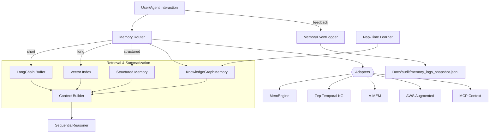

Title: ISA Memory Architecture — Modular, Multi-Backend, CI-Gated
Last updated: 2025-09-02

Overview: Multi-backend memory system combining buffer/summary/vector, structured facts, temporal KG, and adapters to external tools. All memory writes are logged for audits; CI includes coherence and determinism checks.

Mermaid

Routing
- Short-term: recent exchanges buffered (LangChain adapter or local buffer)
- Long-term: vector index and KG (entities + relations) provide retrieval
- Structured: typed facts (owners, IDs, policy decisions) kept in structured store
- External: Adapters AMEM, Zep, MemEngine, AWS, MCP included as optional modules

Policies
- All writes logged to `agent/memory/memory_log.jsonl`
- Deletions audited in the same log with reason/actor
- Nap-time summarization condenses recent events into long-term KG

CI Gates
- Determinism snapshot (canonical JSON)
- Memory coherence advisory gate (`scripts/memory_coherence_gate.py`)
- Memory logs snapshot uploaded as artifact

Adoption
- Adapters are optional; router degrades gracefully
- Feature flags via environment variables to steer routing or destinations

