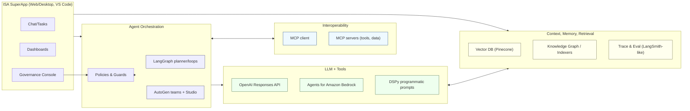

# Agent Orchestration & Interoperability — LangGraph, AutoGen, LLM Runtimes, RAG, MCP
Last updated: 2025-09-02

Overview
This architecture integrates best-in-class tooling for planning/loops (LangGraph), rapid multi‑agent prototyping (AutoGen + Studio), portable LLM runtimes (OpenAI Responses API, Bedrock Agents), declarative prompt programming (DSPy), robust RAG (Pinecone + indexers), and standardized interop (MCP) — with CI enforcement.

Mermaid

Why these components
- LangGraph: controllable, fault‑tolerant agent graphs with persistence for plan→act→reflect.
- Plan‑and‑Execute: lower cost/latency for multi‑step tasks vs stepwise ReAct where appropriate.
- AutoGen + Studio: fast prototyping of multi‑agent teams before hardening into LangGraph.
- OpenAI Responses API: unified tool‑calling interface; runtime kept swappable.
- Bedrock Agents: managed agent execution integrated with AWS knowledge bases and ops.
- DSPy: declarative prompt programming; self‑improving modules with training/compile scripts.
- Pinecone RAG: chunk→embed→index→retrieve as an industry‑standard grounding path.
- MCP: standard protocol for tool/data access (“USB‑C for AI”) across vendors and OS.

Adoption Plan (Repos/Packages)
1) packages/orchestrator — LangGraph graphs (plan→tool→reflect; long‑running jobs)
2) packages/agents/autogen — AutoGen teams + Studio canvas configs (design‑time)
3) packages/llm — runtime layer (OpenAI Responses, Bedrock Agents) with one interface
4) packages/dspy — DSPy modules + training/compile scripts for top tasks
5) infra/rag — ingestion, embeddings, Pinecone indexers, retrievers, eval notebooks
6) infra/mcp — MCP client + servers (FS, Git, Build, GS1 feeds) with secure defaults
7) CI — run graphs, RAG tests, DSPy evals, MCP smoke; publish traces and coverage
8) SuperApp refactor — call orchestrator only; forbid direct LLM calls

Gating & Evidence
- Parity tests for LLM runtimes; swap without behavior regressions on evals
- RAG evals: grounded accuracy and latency/$$ budgets; snapshot fixtures
- DSPy: eval harness with pass/fail metrics; compiled artifacts checked in
- MCP: client/server smoke (FS, Git, Build); permission boundaries validated
- CI publishes traces and evidence; PRs reference artifacts
