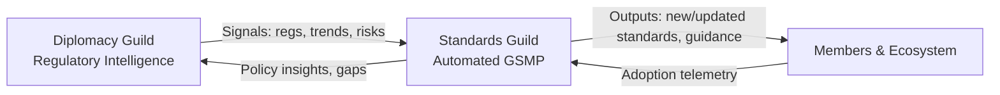

Title: Intelligence‑Driven Future — Roadmap for Diplomacy & Standards Guilds
Last updated: 2025-09-02

Executive Summary
The global supply chain is shifting under simultaneous pressures: rapid digitalization and rising regulatory complexity. GS1 Netherlands should evolve from reactive standards administration to proactive orchestration. Two cornerstone initiatives deliver this: (1) the Diplomacy Guild — a Global Policy & Regulatory Intelligence (RI) platform that senses and predicts change; and (2) the Standards Guild — an AI‑augmented, end‑to‑end standards lifecycle that responds at the speed of business. Together they form a closed feedback loop that institutionalizes learning and secures long‑term leadership.

Mermaid — Synergy Engine

Diplomacy Guild — Global Policy & Regulatory Intelligence (RI)
- Mission: Move from manual, relationship‑driven engagement to proactive, data‑driven foresight. Offer “Intelligence‑as‑a‑Service” for members.
- Core capabilities:
  - Automated global monitoring: crawlers/APIs across official portals, regulators, legislative DBs; multilingual coverage.
  - NLP analysis/summarization: executive briefs, extracted requirements/deadlines, sentiment, affected sectors.
  - Horizon scanning: trend detection over research, patents, NGO/industry reports; early warnings (2–5 year horizon).
  - Stakeholder/engagement graph: bodies, committees, influencers; positions and GS1 engagement history.
  - Alerts/dashboards: role‑based; real‑time and scheduled intelligence briefings.
- Intelligence‑as‑a‑Service: tiered member offering (sector briefs, real‑time alerts, market‑entry packs).
- Acceptance signals (examples): coverage breadth, time‑to‑alert, summary accuracy, prediction hit‑rate, member NPS.

Standards Guild — AI‑Augmented Standards Lifecycle (GSMP)
- Mission: Compress time‑to‑market; reduce toil; raise quality. Augment experts, do not replace them.
- Phases and features:
  1) Opportunity Engine — predictive analytics over RI + market/tech signals to open work items proactively.
  2) Workshop — secure, real‑time co‑authoring with version history, threaded comments, AI Copilot for phrasing/consistency.
  3) Forum — AI‑assisted comment triage; structured dissent resolution; secure digital balloting with configurable rules.
  4) Publisher — automated validation/linting; one‑click multi‑format publication (PDF/HTML/JSON), cross‑standard consistency checks.
- Acceptance signals (examples): cycle‑time reduction, comment resolution throughput, validation defects, publication latency.

Strategic Value (both guilds)
- Risk mitigation for members (early compliance guidance); data‑backed advocacy; faster, higher‑quality standards; new revenue via RI subscriptions; superior contributor UX.

Implementation Roadmap
- Phase 1 (Months 1–9): MVPs — RI monitoring/alerts; Workshop + digital balloting.
- Phase 2 (Months 10–18): AI layers — horizon scanning, NLP summaries, Opportunity Engine, Copilot; wire closed loop (RI→SG and SG→RI).
- Phase 3 (Months 19–24): Member‑facing rollout — portal dashboards, self‑serve sector packs; onboard external workgroups.

Technology & Operations
- Cloud‑native; adapterized external AI/NLP services; open standards for collaboration/versioning.
- Data governance: classification, access, retention, privacy; audit trails for submissions, comments, ballots.
- Change management: training, incentives, and comms; track adoption KPIs per persona.

KPIs & Gates (illustrative)
- RI: coverage ≥90% priority sources; P95 time‑to‑alert ≤24h; predictive horizon wins logged monthly.
- SG: P50 cycle‑time ↓50%; dissent resolution SLA met; zero critical validation defects post‑publish.
- Member impact: usage/retention; subscription revenue targets for Intelligence‑as‑a‑Service.

References
- Linked docs: ROADMAP (Tracks DG, SG), TODO (sections for DG/SG), QUALITY_GATES (gates), CI_WORKFLOWS (planned checks).
