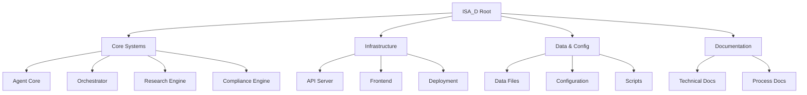

# ISA_D Project Structure and Component Relationships

This document provides a comprehensive overview of the ISA_D project structure, component relationships, and navigation guide for developers.

## 🏗️ High-Level Architecture



## 📁 Directory Structure Overview

### Root Level Directories

| Directory | Purpose | Key Contents |
|-----------|---------|--------------|
| `src/` | Core source code | Agent systems, APIs, integrations |
| `docs/` | Documentation | Architecture, guides, specifications |
| `scripts/` | Automation scripts | Build, deploy, utility scripts |
| `data/` | Data files | Research ledgers, manifests, knowledge bases |
| `agent/` | Agent components | Memory, policy, outcomes |
| `frontend/` | Web interface | React/Vue components, assets |
| `helm/` | Kubernetes deployment | Helm charts for K8s deployment |
| `infra/` | Infrastructure code | Terraform, Ansible, Docker |
| `k8s/` | Kubernetes manifests | YAML configs for K8s |
| `tests/` | Test suites | Unit, integration, e2e tests |
| `experiments/` | Research experiments | POC implementations |
| `packages/` | Python packages | Modular components |

### Core Source Code (`src/`)

The `src/` directory contains the main application code organized by functional domains:

```
src/
├── __init__.py
├── api_server.py              # FastAPI server with Socket.io
├── audit_logger.py             # Audit logging system
├── auth.py                     # Authentication modules
├── benchmark_suite.py          # Performance benchmarking
├── database_manager.py         # Database operations
├── encryption.py               # Encryption utilities
├── end_to_end_traceability.py  # Supply chain traceability
├── epcis_tracker.py            # EPCIS event tracking
├── feature_flags.py            # Feature flag management
├── gs1_*.py                    # GS1 standards integration
├── neo4j_*.py                  # Graph database integration
├── opa_integration.py          # Open Policy Agent
├── optimized_*.py              # Performance optimizations
├── performance_monitor.py      # System monitoring
├── supplier_attestation_vc.py  # Verifiable credentials
├── vc_*.py                     # Verifiable credential system
├── webvoc_loader.py            # Web vocabulary loading
├── xml_utils.py                # XML processing utilities
├── agent_core/                 # Agent architecture
├── cache/                      # Multi-level caching
├── config/                     # Configuration modules
├── dmn/                        # Decision model notation
├── docs_provider/              # Document processing
├── dspy/                       # DSPy modules
├── geospatial/                 # Location-based features
├── langgraph_agents/           # LangGraph agent workflows
├── llm/                        # LLM runtime
├── orchestrator/               # Workflow orchestration
├── privacy_preserving_ai/      # Privacy-preserving AI
├── semantic_validation/        # Semantic validation
├── taxonomy/                   # Taxonomy management
└── tools/                      # Utility tools
```

#### Key Component Relationships

- **API Server** → **Agent Core**: Server routes requests to agent orchestrator
- **Agent Core** → **Orchestrator**: Agents use orchestrator for workflow management
- **Orchestrator** → **LLM Runtime**: Workflows call LLM services
- **Research Engine** → **Vector Store**: Document processing feeds knowledge base
- **Compliance Engine** → **DMN Engine**: Rules engine for compliance decisions

### Agent System (`agent/`)

```
agent/
├── check.py           # Agent health checks
├── policy.py          # Agent policies
├── memory/            # Agent memory system
└── outcomes/          # Agent execution results
```

### Data Layer (`data/`)

```
data/
├── data_catalog.yaml              # Data catalog definition
├── research_ledger_template.yaml  # Research tracking template
├── ingestion_manifests/           # Data ingestion configurations
│   ├── isa_docs_v1_manifest.yaml
│   └── isa_goals_pdfs_manifest.yaml
└── [other data files]
```

### Scripts (`scripts/`)

Utility scripts organized by function:

- **Audit & Quality**: `audit_*.py`, `validate_*.py`
- **Build & Deploy**: `deploy_*.sh`, `build_*.sh`
- **Data Processing**: `ingest_*.py`, `process_*.py`
- **Monitoring**: `healthcheck.py`, `performance_*.py`
- **Research**: `research/`, `evaluate_*.py`

### Documentation (`docs/`)

Comprehensive documentation structure:

```
docs/
├── ADR/                    # Architecture Decision Records
├── agents/                 # Agent-specific documentation
├── audit/                  # Audit reports and analysis
├── data_quality/           # Data quality standards
├── disaster-recovery/      # DR plans and procedures
├── guild/                  # Guild-specific docs
├── interop/                # Interoperability specs
├── issues/                 # Issue tracking and resolution
├── llm/                    # LLM integration docs
├── model_cards/            # AI model documentation
├── ops/                    # Operations guides
├── rag/                    # RAG system documentation
├── research/               # Research methodologies
├── templates/              # Documentation templates
└── [various .md files]
```

## 🔗 Component Dependencies

### Runtime Dependencies
```
API Server
├── FastAPI + Uvicorn
├── Socket.io for real-time
└── Authentication middleware

Agent Core
├── TypedDict for interfaces
├── Asyncio for concurrency
└── Pydantic for validation

Orchestrator
├── LangGraph for workflows
├── NetworkX for graphs
└── Asyncio for coordination

LLM Runtime
├── Multiple provider SDKs
├── Caching layer
└── Rate limiting
```

### Development Dependencies
```
Testing: pytest, pytest-cov
Linting: ruff, mypy
Formatting: black, isort
Documentation: Sphinx, MyST
CI/CD: GitHub Actions, pre-commit
```

## 🚀 Common Workflows

### Development Workflow
1. **Code Changes** → `src/` directories
2. **Test Updates** → `tests/` directory
3. **Documentation** → `docs/` directory
4. **Scripts** → `scripts/` directory

### Deployment Workflow
1. **Container Build** → `Dockerfile`, `docker-compose.yml`
2. **K8s Deployment** → `helm/`, `k8s/`
3. **Infrastructure** → `infra/`
4. **Configuration** → `.env`, `config/`

### Research Workflow
1. **Experiments** → `experiments/`
2. **Data** → `data/`
3. **Results** → `docs/research/`
4. **Integration** → `src/` modules

## 📋 File Naming Conventions

### Python Files
- `snake_case.py` for modules
- `CamelCase.py` for classes (when single-class files)
- `test_*.py` for test files
- `*_test.py` for test modules

### Configuration Files
- `.env` for environment variables
- `config.yaml`/`config.json` for app config
- `pyproject.toml` for Python project config
- `requirements*.txt` for dependencies

### Documentation
- `README.md` for directory documentation
- `GUIDE.md` for user guides
- `ARCHITECTURE.md` for technical specs
- `CHANGELOG.md` for version history

## 🔍 Navigation Guide

### Finding Code by Function
- **Agent Logic** → `src/agent_core/`
- **API Endpoints** → `src/api_server.py`
- **Database** → `src/database_manager.py`
- **Research** → `src/docs_provider/`
- **Compliance** → `src/dmn/`, `src/gs1_*`

### Finding Configuration
- **Environment** → `.env`, `.env.example`
- **App Config** → `src/config/`
- **Build Config** → `pyproject.toml`, `setup.py`
- **CI/CD** → `.github/workflows/`

### Finding Documentation
- **Architecture** → `docs/AGENTIC_ARCHITECTURE.md`
- **API Reference** → `docs/` (various)
- **Setup Guides** → `README.md` files
- **Research** → `docs/research/`

This structure provides a scalable foundation for the ISA_D platform while maintaining clear separation of concerns and easy navigation for developers.- frontend/src/components/demo/
- frontend/src/components/demo/
