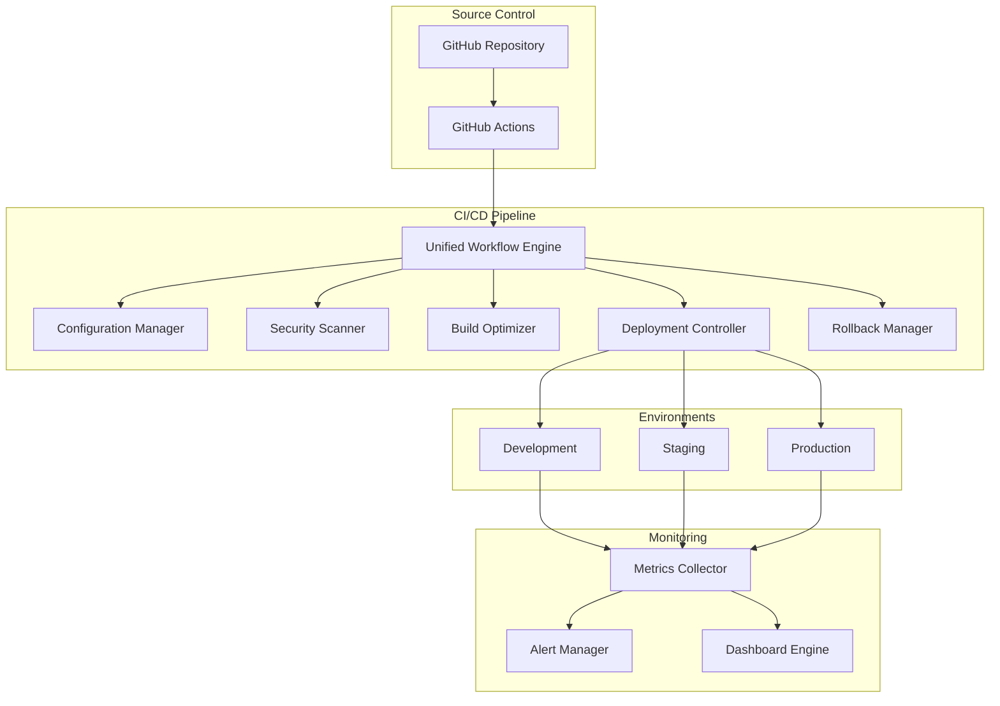
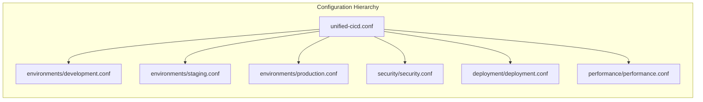
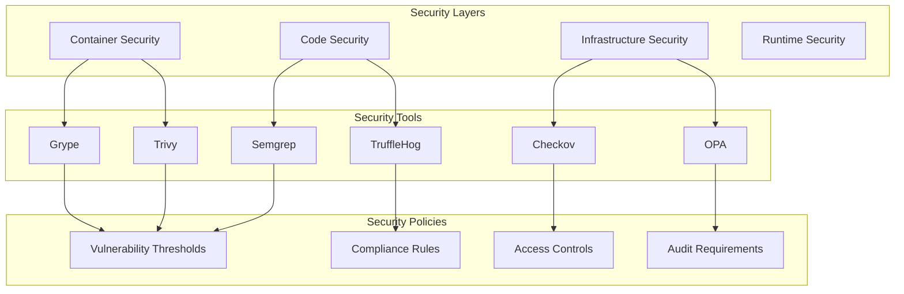
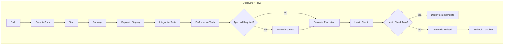
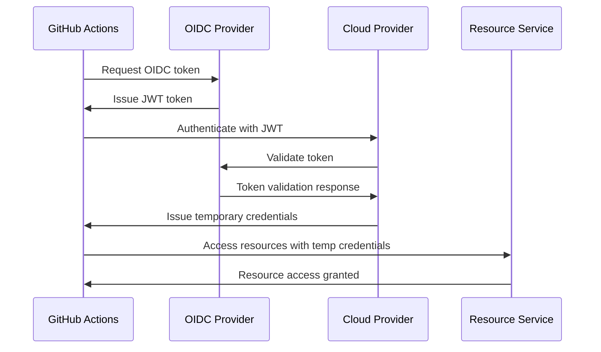
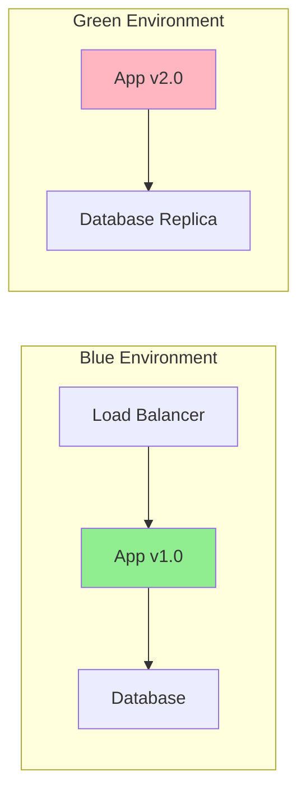
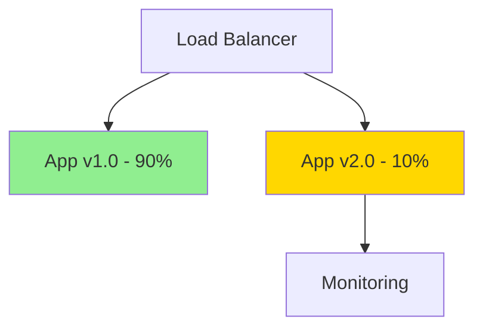
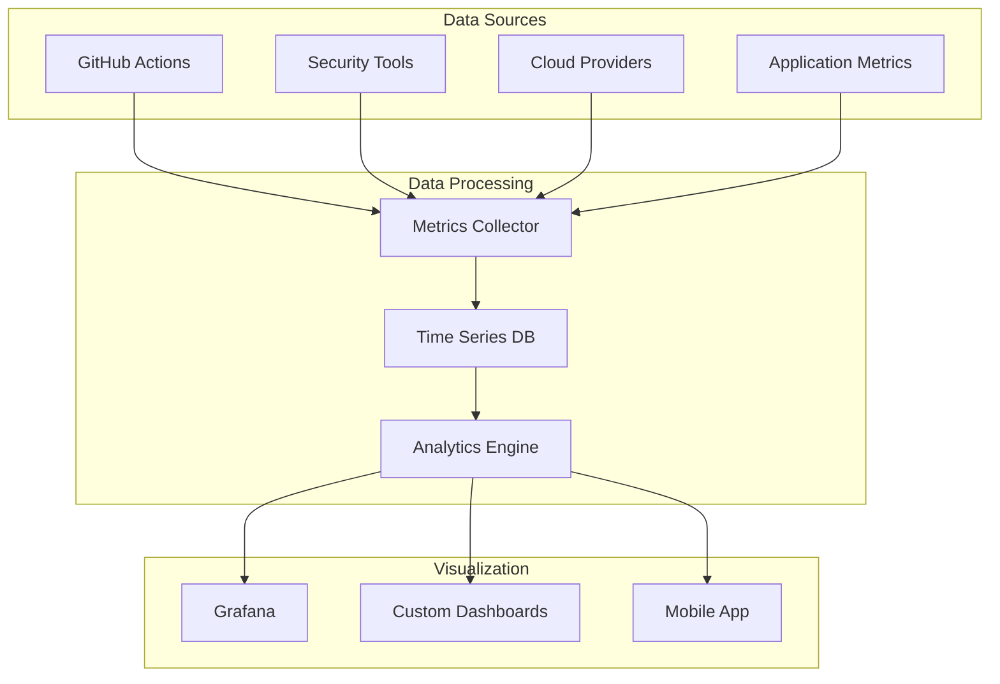

# Unified CI/CD Architecture Documentation

## Executive Summary

This document provides a comprehensive overview of the unified CI/CD pipeline architecture, design decisions, implementation details, and operational considerations. The unified pipeline consolidates multiple disparate workflows into a single, efficient, and secure deployment system that addresses the complexity and duplication found in traditional multi-workflow approaches.

## Table of Contents

1. [Architecture Overview](#architecture-overview)
2. [Design Principles](#design-principles)
3. [Component Architecture](#component-architecture)
4. [Security Architecture](#security-architecture)
5. [Deployment Strategies](#deployment-strategies)
6. [Monitoring & Observability](#monitoring--observability)
7. [Scalability Considerations](#scalability-considerations)
8. [Operational Excellence](#operational-excellence)
9. [Migration Strategy](#migration-strategy)
10. [Future Enhancements](#future-enhancements)

## Architecture Overview

### High-Level Architecture

The unified CI/CD pipeline follows a modular, event-driven architecture that separates concerns while maintaining tight integration between components. The architecture is designed around the principle of "configure once, deploy anywhere" with environment-specific customization capabilities.



### Core Components

#### 1. Unified Workflow Engine
The central orchestrator that manages the entire CI/CD pipeline execution. It handles:
- Event processing and workflow triggering
- Configuration loading and validation
- Component coordination and dependency management
- Error handling and recovery
- Status reporting and notifications

#### 2. Configuration Manager
Manages all configuration aspects of the pipeline:
- Environment-specific settings
- Security policies and thresholds
- Performance parameters
- Deployment strategies
- Monitoring configurations

#### 3. Security Scanner
Comprehensive security scanning component that integrates multiple tools:
- Container vulnerability scanning (Trivy, Grype)
- Static code analysis (Semgrep)
- Secret detection (TruffleHog)
- Infrastructure scanning (Checkov)
- Compliance checking

#### 4. Build Optimizer
Optimizes build processes through:
- Intelligent caching strategies
- Parallel execution optimization
- Resource utilization optimization
- Build artifact management
- Dependency resolution optimization

#### 5. Deployment Controller
Manages deployment processes across environments:
- Environment-specific deployment strategies
- Health check validation
- Traffic management
- Rollout coordination
- Post-deployment validation

#### 6. Rollback Manager
Handles deployment rollbacks with:
- Automated rollback triggers
- Manual rollback capabilities
- Rollback validation
- State restoration
- Impact assessment

## Design Principles

### 1. Single Source of Truth
All configuration is centralized in the `config/` directory with environment-specific overrides, ensuring consistency and reducing configuration drift.

### 2. Security by Design
Security is integrated at every layer:
- OIDC-based authentication eliminates credential storage
- Security scanning is mandatory and non-bypassable
- Vulnerability thresholds prevent vulnerable deployments
- Compliance checks ensure regulatory requirements are met

### 3. Progressive Deployment
Deployments follow a progressive strategy:
- Development: Continuous deployment with minimal gates
- Staging: Comprehensive testing and validation
- Production: Multi-stage approval and health validation

### 4. Observability First
Comprehensive monitoring and logging:
- Structured logging throughout the pipeline
- Metrics collection for all components
- Alerting for critical issues
- Dashboards for visibility

### 5. Failure Resilience
Built-in resilience mechanisms:
- Automatic retry with exponential backoff
- Circuit breaker patterns for external dependencies
- Graceful degradation
- Comprehensive error handling

## Component Architecture

### Configuration Architecture



### Security Architecture



### Deployment Architecture



## Security Architecture

### Authentication & Authorization

The unified pipeline implements a zero-trust security model with OIDC-based authentication:

#### OIDC Flow


### Security Scanning Integration

The security architecture integrates multiple scanning tools with a unified reporting mechanism:

#### Vulnerability Management
- **Scanning Frequency**: Every build, with nightly deep scans
- **Vulnerability Database**: Updated daily from multiple sources
- **Threshold Management**: Configurable severity thresholds per environment
- **Exception Handling**: Approved vulnerability management process

#### Secret Management
- **No Secrets in Code**: Automated detection and prevention
- **Secret Rotation**: Automated rotation for deployed secrets
- **Access Audit**: Complete audit trail for secret access
- **Encryption**: All secrets encrypted at rest and in transit

### Compliance Framework

The pipeline supports multiple compliance frameworks:

- **SOC 2**: Automated evidence collection and reporting
- **PCI DSS**: Payment card industry compliance checks
- **HIPAA**: Healthcare data protection compliance
- **GDPR**: European data protection compliance
- **Custom**: Organization-specific compliance requirements

## Deployment Strategies

### Blue-Green Deployment



**Process:**
1. Deploy new version to Green environment
2. Run health checks and validation tests
3. Switch load balancer to Green environment
4. Monitor for issues
5. Keep Blue environment for quick rollback

### Canary Deployment



**Process:**
1. Deploy new version to small subset of instances (10%)
2. Monitor metrics and error rates
3. Gradually increase traffic to new version
4. Full rollout if metrics are healthy
5. Automatic rollback if issues detected

### Feature Flags Integration

The pipeline supports feature flag integration for progressive feature rollout:

```yaml
feature_flags:
  new_checkout_flow:
    enabled: false
    rollout_percentage: 0
    environments:
      - development
      - staging
  enhanced_search:
    enabled: true
    rollout_percentage: 50
    environments:
      - production
```

## Monitoring & Observability

### Metrics Collection

The pipeline collects comprehensive metrics across all components:

#### Performance Metrics
- **Build Duration**: Time taken for each build stage
- **Deployment Duration**: Time from commit to production
- **Queue Time**: Time spent waiting for resources
- **Resource Utilization**: CPU, memory, disk usage

#### Quality Metrics
- **Test Coverage**: Code coverage percentages
- **Security Vulnerabilities**: Count and severity
- **Code Quality**: Static analysis scores
- **Dependency Health**: Outdated and vulnerable dependencies

#### Reliability Metrics
- **Success Rate**: Percentage of successful deployments
- **Mean Time to Recovery (MTTR)**: Time to recover from failures
- **Change Failure Rate**: Percentage of changes that cause failures
- **Deployment Frequency**: Number of deployments per time period

### Alerting Strategy

Alerts are configured with a tiered approach:

#### Critical Alerts (Immediate Action Required)
- Production deployment failures
- Security vulnerabilities above threshold
- Infrastructure failures
- Data loss incidents

#### Warning Alerts (Action Required Within 4 Hours)
- Staging deployment failures
- Performance degradation
- High resource utilization
- Failed security scans

#### Info Alerts (Action Required Within 24 Hours)
- Build failures in development
- Minor security findings
- Configuration drift
- Documentation updates needed

### Dashboard Architecture



## Scalability Considerations

### Horizontal Scaling

The pipeline is designed to scale horizontally:

#### Build Scaling
- **Parallel Jobs**: Multiple builds can run simultaneously
- **Resource Pools**: Dynamic resource allocation based on demand
- **Queue Management**: Intelligent queuing with priority handling
- **Cache Distribution**: Distributed caching across multiple runners

#### Deployment Scaling
- **Multi-Region Deployment**: Simultaneous deployment to multiple regions
- **Rolling Updates**: Gradual rollout across instances
- **Load Balancer Integration**: Automatic scaling based on traffic
- **Database Migration**: Zero-downtime database updates

### Vertical Scaling

Resource allocation scales based on workload:

#### Build Resources
- **CPU Scaling**: Automatic CPU allocation based on build complexity
- **Memory Scaling**: Dynamic memory allocation for large projects
- **Storage Scaling**: Automatic storage provisioning for artifacts
- **Network Scaling**: Bandwidth optimization for large transfers

#### Security Scanning
- **Parallel Scanning**: Multiple security tools run in parallel
- **Incremental Scanning**: Only scan changed components
- **Resource Optimization**: Allocate resources based on scan complexity
- **Result Caching**: Cache scan results for unchanged components

### Performance Optimization

#### Build Optimization
- **Dependency Caching**: Cache dependencies across builds
- **Incremental Builds**: Only rebuild changed components
- **Parallel Execution**: Run independent tasks in parallel
- **Resource Pre-allocation**: Pre-allocate resources for known workloads

#### Deployment Optimization
- **Image Optimization**: Multi-stage builds with size optimization
- **Layer Caching**: Optimize Docker layer caching
- **Registry Optimization**: Use regional registries for faster pulls
- **Network Optimization**: Optimize network paths for deployment

## Operational Excellence

### Reliability Engineering

#### Error Handling
- **Graceful Degradation**: Continue operation with reduced functionality
- **Circuit Breakers**: Prevent cascade failures
- **Retry Logic**: Automatic retry with exponential backoff
- **Fallback Mechanisms**: Alternative paths for critical operations

#### Disaster Recovery
- **Backup Strategy**: Regular backup of configuration and state
- **Recovery Procedures**: Documented recovery procedures
- **Testing**: Regular disaster recovery testing
- **Documentation**: Comprehensive runbooks for all scenarios

### Maintenance Procedures

#### Regular Maintenance
- **Security Updates**: Regular updates to security tools and policies
- **Dependency Updates**: Regular updates to dependencies
- **Performance Tuning**: Regular performance optimization
- **Documentation Updates**: Keep documentation current

#### Capacity Planning
- **Resource Monitoring**: Monitor resource utilization trends
- **Growth Planning**: Plan for future growth
- **Cost Optimization**: Optimize costs while maintaining performance
- **Scaling Triggers**: Define triggers for automatic scaling

### Change Management

#### Change Process
1. **Change Request**: Document proposed changes
2. **Impact Assessment**: Assess impact on existing systems
3. **Testing**: Test changes in non-production environments
4. **Approval**: Get approval from stakeholders
5. **Implementation**: Implement changes with rollback plan
6. **Validation**: Validate changes work as expected
7. **Documentation**: Update documentation

#### Rollback Procedures
- **Automatic Rollback**: Triggered by health checks
- **Manual Rollback**: Manual trigger for immediate rollback
- **Gradual Rollback**: Gradual rollback for minimal impact
- **Complete Rollback**: Full rollback to previous state

## Migration Strategy

### Assessment Phase

#### Current State Analysis
1. **Inventory Existing Workflows**: Document all existing CI/CD workflows
2. **Identify Dependencies**: Map dependencies between workflows
3. **Analyze Usage Patterns**: Understand how workflows are used
4. **Security Assessment**: Review current security practices
5. **Performance Baseline**: Establish performance baselines

#### Migration Planning
1. **Prioritization**: Prioritize workflows for migration
2. **Timeline**: Create realistic migration timeline
3. **Resource Allocation**: Allocate resources for migration
4. **Risk Assessment**: Identify and mitigate migration risks
5. **Success Criteria**: Define success criteria for migration

### Migration Execution

#### Phased Approach
1. **Phase 1**: Non-critical workflows (development, testing)
2. **Phase 2**: Staging workflows
3. **Phase 3**: Production workflows (low-risk)
4. **Phase 4**: Production workflows (high-risk)
5. **Phase 5**: Legacy workflow decommissioning

#### Migration Steps
1. **Parallel Operation**: Run old and new workflows in parallel
2. **Validation**: Validate new workflow produces same results
3. **Gradual Cutover**: Gradually shift traffic to new workflow
4. **Monitoring**: Monitor closely during cutover
5. **Rollback Plan**: Have rollback plan ready

### Post-Migration

#### Validation
- **Functionality Testing**: Ensure all functionality works
- **Performance Testing**: Verify performance meets requirements
- **Security Testing**: Confirm security posture is maintained
- **User Acceptance**: Get user acceptance of new workflow

#### Optimization
- **Performance Tuning**: Optimize based on real usage
- **Cost Optimization**: Optimize costs based on actual usage
- **Process Improvement**: Improve processes based on lessons learned
- **Documentation**: Update documentation based on experience

## Future Enhancements

### Planned Features

#### AI/ML Integration
- **Intelligent Testing**: AI-powered test generation and optimization
- **Predictive Analytics**: Predict deployment failures before they happen
- **Anomaly Detection**: ML-based anomaly detection in deployments
- **Performance Optimization**: AI-driven performance optimization

#### Advanced Deployment Strategies
- **Microservices Orchestration**: Advanced microservices deployment
- **Service Mesh Integration**: Integration with service mesh technologies
- **Multi-Cloud Deployment**: Seamless multi-cloud deployment
- **Edge Computing**: Support for edge computing deployments

#### Enhanced Security
- **Zero-Trust Architecture**: Full zero-trust implementation
- **Advanced Threat Detection**: AI-powered threat detection
- **Compliance Automation**: Automated compliance reporting
- **Security Orchestration**: Automated security response

### Technology Roadmap

#### Short Term (3-6 months)
- Enhanced monitoring and alerting
- Improved performance optimization
- Better integration with cloud-native tools
- Enhanced security scanning capabilities

#### Medium Term (6-12 months)
- AI/ML integration for predictive analytics
- Advanced deployment strategies
- Multi-cloud orchestration
- Enhanced compliance frameworks

#### Long Term (12+ months)
- Full zero-trust architecture
- Autonomous operations
- Advanced threat detection and response
- Self-healing infrastructure

## Conclusion

The unified CI/CD pipeline represents a significant advancement in deployment automation, providing a comprehensive, secure, and efficient solution for modern software delivery. By consolidating multiple workflows into a single, intelligent system, organizations can achieve:

- **Reduced Complexity**: Single workflow to manage and maintain
- **Improved Security**: Consistent security practices across all deployments
- **Faster Delivery**: Optimized processes and intelligent caching
- **Better Reliability**: Comprehensive monitoring and automated rollback
- **Lower Costs**: Reduced maintenance overhead and optimized resource usage

The architecture is designed to be flexible and extensible, allowing organizations to adapt it to their specific needs while maintaining the core benefits of standardization and automation. As the platform evolves, it will continue to incorporate new technologies and best practices to remain at the forefront of CI/CD innovation.

---

*This document is a living document and will be updated as the architecture evolves. For the latest information, please refer to the repository documentation.*