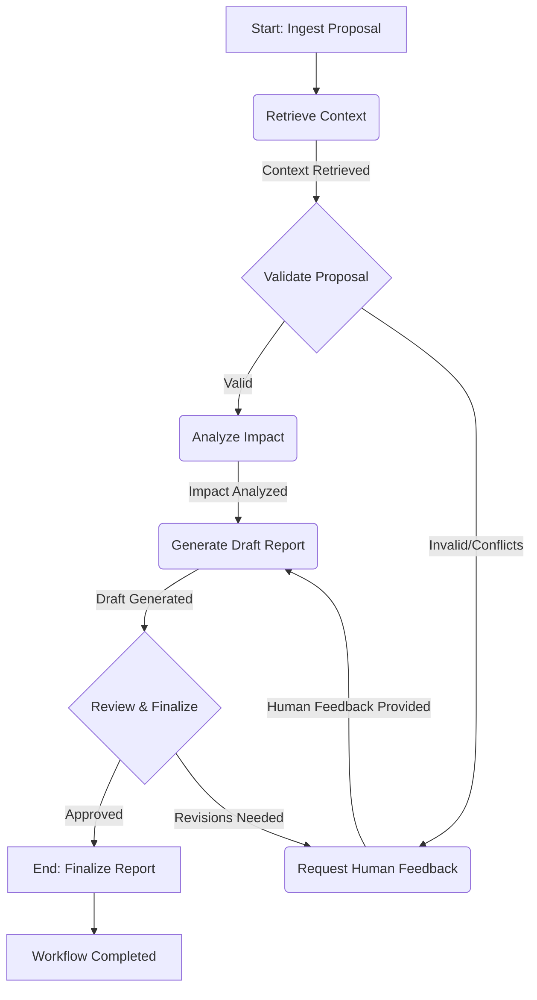

# Plan: Designing the "New Standard Proposal Review" Agentic Workflow with LangGraph

## Objective
To create a robust, auditable, and automated workflow for reviewing new GS1 standard proposals, leveraging LangGraph for orchestration and integrating existing/planned ISA components.

## Use Case
Automating the "New Standard Proposal Review" process, from initial ingestion to generating an impact report and routing for human feedback.

## 1. Workflow Definition and Steps

The workflow will encompass the following logical steps, each potentially represented by a LangGraph node:

*   **Ingest Proposal**: Receive the raw standard proposal (e.g., PDF, markdown).
*   **Retrieve Context**: Gather relevant existing GS1 standards, rules, and related documentation from the Knowledge Graph and Vector Database.
*   **Validate Proposal**: Check the proposal against existing GS1 specifications and rules for consistency, conflicts, and compliance.
*   **Analyze Impact**: Determine the potential impact of the proposed changes on existing standards, industry practices, and related entities.
*   **Generate Draft Report**: Synthesize findings into a structured impact report.
*   **Request Human Feedback**: If validation issues or high-risk impacts are detected, route the proposal and report to a human expert for review and clarification.
*   **Finalize Report**: Incorporate human feedback (if any) and finalize the impact report.

## 2. Mapping Genkit Flows to LangGraph Tools (Nodes)

We will encapsulate existing or planned Genkit flows as modular tools that LangGraph can invoke.

*   **`ingestDocumentTool`**:
    *   **Input**: Raw proposal document (e.g., file path, URL).
    *   **Output**: Parsed, structured text, and extracted metadata.
    *   **Genkit Flow**: A new Genkit flow that leverages the ELTVRE pipeline's extraction capabilities.
*   **`knowledgeGraphRetriever`**:
    *   **Input**: Key concepts or entities from the proposal.
    *   **Output**: Structured data (entities, relationships, rules) from TypeDB.
    *   **Genkit Flow**: Existing or new Genkit tool wrapping the TypeDB Python driver.
*   **`vectorSearchRetriever`**:
    *   **Input**: Semantic query based on proposal content.
    *   **Output**: Relevant text chunks/documents from the Vector Database.
    *   **Genkit Flow**: Existing `answerGs1QuestionsWithVectorSearch` flow or a dedicated retrieval flow.
*   **`genSpecValidator`**:
    *   **Input**: Proposal content, retrieved KG rules, and vector context.
    *   **Output**: Validation results (e.g., `isValid: boolean`, `errors: []`, `conflicts: []`).
    *   **Genkit Flow**: A new Genkit flow that performs rule-based and LLM-assisted validation.
*   **`impactAnalyzer`**:
    *   **Input**: Proposal, validation results, and KG context.
    *   **Output**: Structured impact analysis (e.g., `riskLevel: string`, `affectedStandards: []`, `implications: string`).
    *   **Genkit Flow**: A new Genkit flow leveraging LLMs and KG traversal for multi-hop reasoning.
*   **`reportDrafter`**:
    *   **Input**: Proposal, validation, and impact analysis results.
    *   **Output**: Draft impact report in markdown or JSON.
    *   **Genkit Flow**: A new Genkit flow for generative report writing, potentially using CoT.
*   **`humanFeedbackRequester`**:
    *   **Input**: Proposal summary, draft report, identified issues.
    *   **Output**: Human feedback (e.g., `clarification: string`, `approval: boolean`).
    *   **Genkit Flow**: A new Genkit flow that triggers an external notification (e.g., email, webhook) and waits for input.

## 3. LangGraph State Definition

A central state object will be defined to track the progress and data of the workflow. This will be a Python dictionary (or a Zod schema if the LangGraph orchestration is in TypeScript) persisted in Firestore.

```python
class ProposalReviewState(TypedDict):
    proposal_id: str
    raw_proposal_content: str
    parsed_content: Optional[str]
    retrieved_kg_context: Optional[dict]
    retrieved_vector_context: Optional[list]
    validation_results: Optional[dict]
    impact_analysis_results: Optional[dict]
    draft_report: Optional[str]
    human_feedback: Optional[dict]
    final_report: Optional[str]
    status: str # e.g., "INGESTED", "VALIDATING", "AWAITING_FEEDBACK", "COMPLETED"
    error_message: Optional[str]
```

## 4. LangGraph Graph Structure and Conditional Logic (Edges)

The workflow will be modeled as a state graph with conditional edges.



**Explanation of Edges:**

*   **Retrieve Context**: Always follows `Ingest Proposal`.
*   **Validate Proposal**:
    *   If `validation_results.isValid` is `True` and no `conflicts` are found, transition to `Analyze Impact`.
    *   If `validation_results.isValid` is `False` or `conflicts` are found, transition to `Request Human Feedback`.
*   **Generate Draft Report**: Can be reached from `Analyze Impact` (initial draft) or `Request Human Feedback` (re-draft after human input).
*   **Review & Finalize**:
    *   If `human_feedback.approval` is `True`, transition to `Finalize Report`.
    *   If `human_feedback.approval` is `False` or `human_feedback.clarification` is provided, loop back to `Request Human Feedback` (or a dedicated "Revise Draft" node if more complex revisions are needed).

## 5. Persistence and Human-in-the-Loop

*   **Persistence**: Cloud Firestore will be used to persist the `ProposalReviewState` after each node execution. This allows long-running workflows to be paused and resumed, and provides an audit trail.
*   **Human-in-the-Loop**: The `humanFeedbackRequester` tool will:
    *   Send a notification (e.g., email, Slack message) to a designated human expert with a link to a UI where they can review the proposal, validation results, and draft report.
    *   The workflow will pause at this node.
    *   A separate Firebase Cloud Function (triggered by a webhook or Firestore write) will update the workflow's state in Firestore with the human's input, allowing LangGraph to resume.

## 6. Implementation Steps (High-Level)

1.  **Define Zod Schemas**: Create Zod schemas for all Genkit tool inputs/outputs and the LangGraph state to ensure type safety and data consistency.
2.  **Develop Genkit Tools**: Implement the new Genkit flows (`ingestDocumentTool`, `genSpecValidator`, `impactAnalyzer`, `reportDrafter`, `humanFeedbackRequester`) as callable tools.
3.  **Set up LangGraph Service**: Create a new Python service (e.g., a Cloud Function) that hosts the LangGraph `StateGraph` definition.
4.  **Integrate Firestore**: Configure LangGraph to use Firestore for state persistence.
5.  **Initial Workflow Definition**: Write the initial LangGraph graph definition in Python (or YAML, if using a YAML-based LangGraph loader).
6.  **Trigger Mechanism**: Define how a new proposal review workflow is initiated (e.g., an HTTP endpoint, a Pub/Sub trigger from a document upload).
7.  **UI Integration**: Develop a basic Next.js UI to display the workflow status, allow human review, and capture feedback.
8.  **Testing**: Implement unit tests for individual Genkit tools and integration tests for the entire LangGraph workflow, mocking external services as needed.