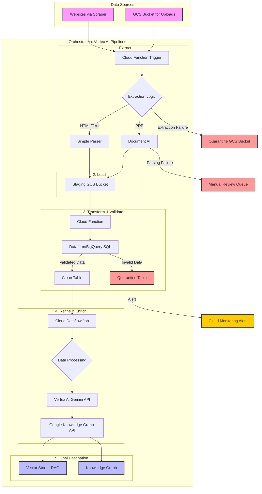

# ELTVRE Pipeline Design

## 1. Objective

This document details the architectural components and workflow for a robust and scalable data ingestion pipeline designed to process GS1 standards documents (especially complex PDFs) into high-quality inputs for the RAG system (vector store) and Knowledge Graph. The ELTVRE (Extract, Load, Transform, Validate, Refine, Enrich) process ensures that data is clean, structured, consistent, and contextually rich before it is used by downstream AI systems.

## 2. ELTVRE Overview

The ELTVRE pipeline is a systematic, multi-stage process for data ingestion and preparation. Each stage has a distinct purpose:

*   **Extract:** Ingest raw data from a variety of sources.
*   **Load:** Place raw data into a centralized staging area for processing.
*   **Transform:** Convert raw, unstructured data into a structured format.
*   **Validate:** Enforce data quality, integrity, and schema adherence.
*   **Refine:** Clean, normalize, and standardize the validated data.
*   **Enrich:** Add contextual value to the data, such as summaries, entities, and relationships.

This structured approach ensures that only high-quality data feeds the RAG and Knowledge Graph, which is critical for the accuracy and reliability of the entire ISA system.

## 3. Workflow and Data Flow

The following diagram illustrates the end-to-end data flow through the ELTVRE pipeline, orchestrated by Vertex AI Pipelines.

## 4. Technology Stack and Error Handling

This section provides a detailed breakdown of each stage, specifying the chosen technologies and their roles, along with error handling and logging mechanisms.

| Stage | Purpose | Technology Stack | Error Handling & Logging |
| :--- | :--- | :--- | :--- |
| **Extract** | Ingest raw documents (PDFs, web pages) from various sources. | • **Google Cloud Storage:** Triggering bucket for uploads. • **Cloud Functions:** To initiate the process. • **Puppeteer/Playwright:** For scheduled web scraping tasks. | • Retry mechanisms for transient network failures. • Failed extractions are logged to Cloud Logging. • Source files that fail consistently are moved to a `quarantine` GCS bucket. |
| **Load** | Place raw, extracted data into a centralized staging area. | • **Google Cloud Storage:** A dedicated staging bucket. | • Log all successful load operations for traceability. • Checksums to ensure data integrity post-transfer. |
| **Transform** | Parse and convert raw data into a structured format (e.g., JSON). | • **Google Document AI:** For complex PDF parsing (tables, layouts). • **Cloud Functions (Python):** To orchestrate parsing and handle simpler formats. | • Parsing errors are logged with document identifiers. • Documents that fail parsing are sent to a `manual_review` queue. • Log the specific reason for failure (e.g., "unrecognized schema"). |
| **Validate** | Ensure data quality, consistency, and schema adherence. | • **Dataform/BigQuery:** For SQL-based validation rules on structured data. • **Great Expectations:** For more complex, programmatic data quality checks within a Cloud Function or Dataflow job. | • Invalid records are flagged and moved to an `invalid_records` table in BigQuery. • Validation failure metrics are sent to Cloud Monitoring to trigger alerts. |
| **Refine** | Clean, normalize, and standardize the validated data. | • **Cloud Dataflow:** For large-scale data cleaning and normalization jobs (e.g., standardizing date formats, cleaning text). | • Log any refinement step that fails. • If a record cannot be refined, it's flagged and potentially sent for manual review. |
| **Enrich** | Add value and context to the data. | • **Vertex AI (Gemini API):** For summarization, entity extraction, and identifying relationships. • **Google Knowledge Graph API:** To link extracted entities to known entities. | • Implement exponential backoff for API rate limits. • If enrichment fails, the core data can proceed but will be flagged as `enrichment_failed`. |

## 5. Orchestration, Monitoring, and Security

### Orchestration
The entire end-to-end workflow will be managed as a Directed Acyclic Graph (DAG) using **Vertex AI Pipelines**. This provides:
*   **Visualization:** A clear graphical representation of the pipeline's execution.
*   **Dependency Management:** Ensures that stages run in the correct order.
*   **Automated Retries:** Configurable retry logic for transient failures.
*   **Parameterization:** Allows for flexible pipeline runs with different inputs.

### Monitoring and Logging
*   **Centralized Logging:** All services will use structured JSON logging and send logs to **Google Cloud Logging**. This allows for powerful filtering and analysis. Each log entry will contain a correlation ID to trace a single document's journey through the pipeline.
*   **Dashboards & Alerts:** **Google Cloud Monitoring** will be used to create dashboards tracking key pipeline metrics (e.g., end-to-end latency, error rates per stage, number of documents in quarantine). Alerts will be configured to notify the operations team of critical failures or performance degradation.

### Security and Data Governance
*   **IAM (Identity and Access Management):** Use fine-grained IAM roles to ensure least-privilege access for all components. Service accounts will have narrowly scoped permissions.
*   **Data Encryption:** All data will be encrypted at rest in Cloud Storage and BigQuery by default. All data in transit will be secured using TLS.
*   **PII Detection:** As a critical safeguard, the **Cloud Data Loss Prevention (DLP) API** will be integrated into the `Validate` step. It will scan the transformed text to detect and redact or flag any inadvertent Personally Identifiable Information (PII) before it is stored or processed further.