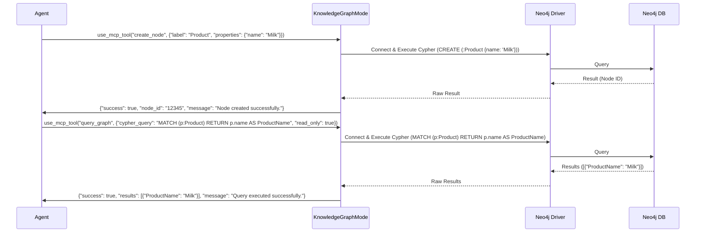

# KnowledgeGraphMode Design Document

## 1. Purpose and Scope

The `KnowledgeGraphMode` is designed to provide a dedicated interface for agents to interact with the Neo4j Knowledge Graph (KG). Its primary purpose is to enable structured storage, retrieval, and manipulation of knowledge, facilitating advanced reasoning, contextual understanding, and data-driven decision-making within the ISA system.

**Scope:**
*   **Direct Interaction:** Allow agents to perform CRUD (Create, Read, Update, Delete) operations on nodes and relationships within the Neo4j KG.
*   **Querying:** Provide a mechanism for agents to execute Cypher queries against the KG for complex data retrieval and analysis.
*   **Integration:** Define clear integration points with the underlying Neo4j database.
*   **Safety and Validation:** Implement safeguards for query execution and robust input/output validation.
*   **Security:** Address authentication, authorization, and data protection for KG interactions.

**Out of Scope:**
*   Complex ETL processes for initial KG population (these will be handled by dedicated ETL pipelines).
*   Advanced graph analytics algorithms (these may be exposed as separate tools or services).
*   User interface for direct human interaction with the KG (this mode is for agent-to-KG interaction).

## 2. Key Tools/Operations

The `KnowledgeGraphMode` will expose the following tools to agents:

### 2.1. `create_node`
*   **Description:** Creates a new node in the Knowledge Graph with specified labels and properties.
*   **Input Schema:**
    ```json
    {
      "label": "string",
      "properties": "object"
    }
    ```
    *   `label`: (Required) The primary label for the new node (e.g., "Product", "Standard", "Concept").
    *   `properties`: (Optional) A JSON object containing key-value pairs for node properties (e.g., `{"name": "GS1 Standard", "version": "2023"}`).
*   **Output Format:**
    ```json
    {
      "success": "boolean",
      "node_id": "string",
      "message": "string"
    }
    ```

### 2.2. `create_relationship`
*   **Description:** Creates a new relationship between two existing nodes.
*   **Input Schema:**
    ```json
    {
      "from_node_id": "string",
      "to_node_id": "string",
      "type": "string",
      "properties": "object"
    }
    ```
    *   `from_node_id`: (Required) The ID of the source node.
    *   `to_node_id`: (Required) The ID of the target node.
    *   `type`: (Required) The type of the relationship (e.g., "HAS_PROPERTY", "DEFINES", "RELATES_TO").
    *   `properties`: (Optional) A JSON object containing key-value pairs for relationship properties.
*   **Output Format:**
    ```json
    {
      "success": "boolean",
      "relationship_id": "string",
      "message": "string"
    }
    ```

### 2.3. `query_graph`
*   **Description:** Executes a Cypher query against the Neo4j Knowledge Graph. This tool will have safeguards to prevent destructive operations unless explicitly permitted and logged.
*   **Input Schema:**
    ```json
    {
      "cypher_query": "string",
      "parameters": "object",
      "read_only": "boolean"
    }
    ```
    *   `cypher_query`: (Required) The Cypher query string.
    *   `parameters`: (Optional) A JSON object of parameters to be used in the Cypher query.
    *   `read_only`: (Required) A boolean flag. If `true`, only read operations (e.g., `MATCH`, `RETURN`) are allowed. If `false`, write operations (`CREATE`, `MERGE`, `SET`, `DELETE`, `DETACH DELETE`) are permitted but will trigger additional logging and potentially require higher authorization.
*   **Output Format:**
    ```json
    {
      "success": "boolean",
      "results": "array",
      "message": "string"
    }
    ```
    *   `results`: An array of JSON objects, where each object represents a row returned by the Cypher query.

### 2.4. `search_nodes`
*   **Description:** Searches for nodes based on specified properties and labels.
*   **Input Schema:**
    ```json
    {
      "label": "string",
      "properties": "object",
      "limit": "integer"
    }
    ```
    *   `label`: (Optional) The label of the nodes to search for.
    *   `properties`: (Optional) A JSON object of properties to match (e.g., `{"name": "Product A"}`).
    *   `limit`: (Optional) Maximum number of results to return (default: 10).
*   **Output Format:**
    ```json
    {
      "success": "boolean",
      "nodes": "array",
      "message": "string"
    }
    ```
    *   `nodes`: An array of JSON objects, each representing a matched node with its ID, labels, and properties.

### 2.5. `get_node_details`
*   **Description:** Retrieves all details (labels and properties) of a specific node by its ID.
*   **Input Schema:**
    ```json
    {
      "node_id": "string"
    }
    ```
    *   `node_id`: (Required) The ID of the node to retrieve.
*   **Output Format:**
    ```json
    {
      "success": "boolean",
      "node": "object",
      "message": "string"
    }
    ```
    *   `node`: A JSON object containing the node's ID, labels, and properties.

### 2.6. `delete_node`
*   **Description:** Deletes a node and all its relationships from the Knowledge Graph. This operation will be guarded with extreme caution and require explicit confirmation or higher authorization.
*   **Input Schema:**
    ```json
    {
      "node_id": "string",
      "force_delete": "boolean"
    }
    ```
    *   `node_id`: (Required) The ID of the node to delete.
    *   `force_delete`: (Required) A boolean flag. Must be `true` to proceed with deletion, indicating explicit intent.
*   **Output Format:**
    ```json
    {
      "success": "boolean",
      "message": "string"
    }
    ```

## 3. Interaction Patterns

Agents will interact with the `KnowledgeGraphMode` by calling its exposed tools via the `use_mcp_tool` mechanism.

*   **Input:** Agents will provide tool names and arguments as JSON objects, adhering to the specified input schemas.
*   **Output:** The mode will return structured JSON responses indicating success or failure, along with relevant data (e.g., created node IDs, query results, node details).
*   **Error Reporting:** In case of errors, the `success` flag will be `false`, and the `message` field will contain a descriptive error message.
*   **Asynchronous Operations:** For potentially long-running queries or bulk operations (if introduced later), the mode might support asynchronous execution with status polling, though initial implementation will be synchronous.

**Example Interaction Flow (Conceptual):**



## 4. Integration Points

The `KnowledgeGraphMode` will integrate with the Neo4j database using an official Neo4j driver (e.g., `neo4j-driver` for Node.js/TypeScript, `neo4j` for Python).

*   **Connection Details:**
    *   Neo4j URI (e.g., `bolt://localhost:7687` or `neo4j+s://<your-neo4j-instance>.databases.neo4j.io`)
    *   Authentication details (username, password, or API key)
    *   Database name (if applicable, for Neo4j Aura or multi-database setups)
*   **Configuration:** These details will be loaded from environment variables or a secure configuration store (e.g., `.env` file, GCP Secret Manager) to ensure sensitive information is not hardcoded.
*   **Driver Usage:**
    *   A single driver instance will be managed by the `KnowledgeGraphMode` to optimize connection pooling.
    *   Sessions will be opened and closed for each operation to ensure proper resource management.
    *   Transactions will be used for write operations to ensure atomicity and data consistency.
*   **Error Handling:** Driver-specific errors (e.g., connection failures, query syntax errors, database constraints) will be caught and translated into user-friendly error messages.

## 5. Error Handling and Validation

Robust error handling and input/output validation are critical for the stability and reliability of the `KnowledgeGraphMode`.

*   **Input Validation:**
    *   All incoming tool arguments will be validated against their respective JSON schemas.
    *   Missing required parameters, incorrect data types, or invalid formats will result in immediate rejection with a clear error message.
    *   For `query_graph`, Cypher query string will be analyzed for basic syntax validity and potential injection attempts (though parameterized queries are the primary defense).
*   **Database Error Handling:**
    *   Catch specific Neo4j driver errors (e.g., `ClientError`, `TransientError`, `DatabaseError`).
    *   Translate these low-level errors into meaningful, actionable messages for the agent.
    *   Log detailed error information (stack traces, query, parameters) to internal logs for debugging.
    *   Implement retry mechanisms for transient errors (e.g., network issues, deadlocks) with exponential backoff.
*   **Output Validation:**
    *   Ensure that the data returned from Neo4j conforms to the expected output formats for each tool.
    *   Handle cases where no results are found gracefully (e.g., `nodes: []` instead of `null`).
*   **Safeguards for `query_graph`:**
    *   **Read-Only Enforcement:** Strictly enforce the `read_only` flag. If `read_only` is `true` and the query contains write clauses (`CREATE`, `MERGE`, `SET`, `DELETE`, `DETACH DELETE`), the query will be rejected.
    *   **Dangerous Query Detection:** Implement a basic heuristic or a more advanced parser to detect potentially dangerous or overly broad queries (e.g., `MATCH (n) DETACH DELETE n`) and require explicit confirmation or higher authorization.
    *   **Resource Limits:** Potentially integrate with Neo4j's query timeout or resource limits to prevent runaway queries.

## 6. Security Considerations

Interacting directly with a database requires careful attention to security.

*   **Authentication:**
    *   Use strong, unique credentials for the Neo4j connection.
    *   Avoid hardcoding credentials; retrieve them from secure environment variables or a secrets management service (e.g., GCP Secret Manager, HashiCorp Vault).
*   **Authorization (Least Privilege):**
    *   The Neo4j user account used by `KnowledgeGraphMode` should have only the minimum necessary permissions. For example, if `delete_node` is rarely used, it might require a separate, more privileged account or an additional authorization step.
    *   Consider Neo4j's built-in role-based access control (RBAC) to define granular permissions for the mode's user.
*   **Input Sanitization and Parameterized Queries:**
    *   **Crucial:** Always use parameterized queries for all data passed into Cypher queries (e.g., node properties, relationship properties, query parameters). This prevents Cypher injection attacks.
    *   Never concatenate raw agent input directly into Cypher query strings.
*   **Logging and Auditing:**
    *   Log all write operations (`create_node`, `create_relationship`, `delete_node`, and `query_graph` with `read_only: false`) with details about the agent, timestamp, and affected data.
    *   Log all failed operations, especially those related to authorization or validation.
    *   Integrate with the ISA's central logging system for security monitoring.
*   **Network Security:**
    *   Ensure the connection to the Neo4j database is encrypted (e.g., using Bolt+SSL or HTTPS for Neo4j Aura).
    *   Restrict network access to the Neo4j instance to only authorized IP addresses or services (e.g., via VPC networks, firewall rules).
*   **Data Protection:**
    *   If sensitive data is stored in the KG, ensure it is encrypted at rest and in transit.
    *   Implement data retention policies and secure deletion procedures.