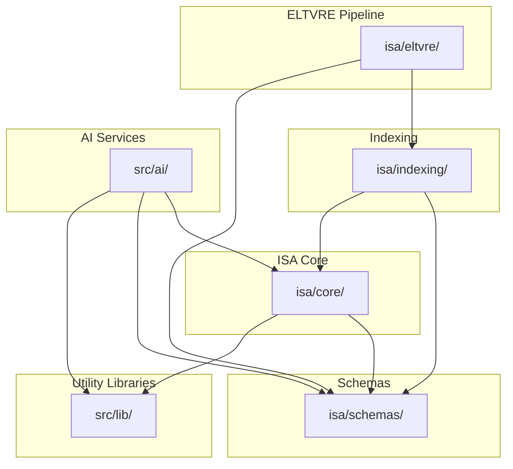
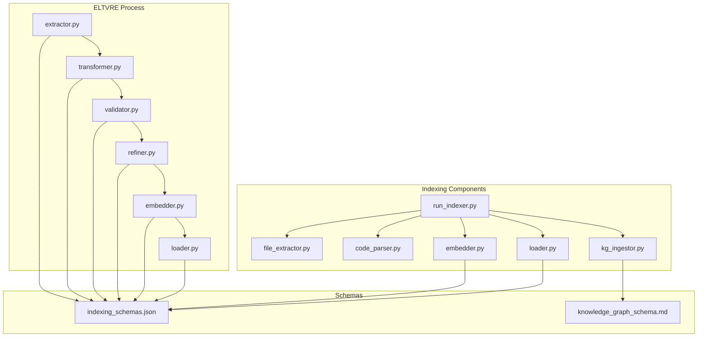

# Inter-Module Dependencies

This document provides a detailed mapping and analysis of dependencies between the various modules within the ISA project. Understanding these dependencies is crucial for maintaining architectural clarity, facilitating refactoring, and ensuring system stability.

## 1. Identified Modules

Based on the current project structure, the primary modules analyzed for dependencies include:

*   **`isa/core/`**: Contains foundational utilities and core workflow implementations.
*   **`isa/eltvre/`**: Implements the Extract, Load, Transform, Validate, Refine, and Embed pipeline.
*   **`isa/indexing/`**: Handles data indexing for search and retrieval.
*   **`isa/schemas/`**: Defines data schemas used across the project.
*   **`src/ai/`**: Contains AI-related flows, tools, and agents.
*   **`src/lib/`**: Contains shared utility libraries.

## 2. Dependency Analysis

This section will detail the observed dependencies between modules.

### 2.1. `isa/core/` Dependencies

*   **`isa/core/isa_validator.py`**:
    *   Depends on: Potentially `isa/schemas/` for validation rules, and `isa/logs/` for logging.
*   **`isa/core/isa_summarizer.py`**:
    *   Depends on: `isa/logs/` for agent task history, and potentially other modules for content to summarize.
*   **`isa/core/run_semantic_search.py`**:
    *   Depends on: `isa/core/search_interface.py`, `isa/indexing/embedder.py`, `isa/indexing/loader.py`, and potentially `src/ai/tools/vector-store-tools.ts`.
*   **`isa/core/search_interface.py`**:
    *   Depends on: Potentially `isa/schemas/indexing_schemas.json`.
*   **`isa/core/validate_llm_keys.py`**:
    *   No direct internal module dependencies.
*   **`isa/core/workflows/langchain_integration.py`**:
    *   Depends on: External LangChain library, and potentially `src/ai/tools/` for specific tools.

### 2.2. `isa/eltvre/` Dependencies

*   **General ELTVRE flow**:
    *   `extractor.py` -> `transformer.py` -> `validator.py` -> `refiner.py` -> `embedder.py` (from `isa/indexing/`) -> `loader.py` (from `isa/indexing/`).
    *   Depends on: `isa/schemas/` for data validation.

### 2.3. `isa/indexing/` Dependencies

*   **`isa/indexing/code_parser.py`**:
    *   No direct internal module dependencies.
*   **`isa/indexing/embedder.py`**:
    *   Depends on: External embedding models/APIs.
*   **`isa/indexing/file_extractor.py`**:
    *   No direct internal module dependencies.
*   **`isa/indexing/kg_ingestor.py`**:
    *   Depends on: `isa/schemas/knowledge_graph_schema.md`, and external Knowledge Graph database.
*   **`isa/indexing/loader.py`**:
    *   Depends on: External vector store or database.
*   **`isa/indexing/run_indexer.py`**:
    *   Depends on: `isa/indexing/file_extractor.py`, `isa/indexing/code_parser.py`, `isa/indexing/embedder.py`, `isa/indexing/loader.py`, `isa/indexing/kg_ingestor.py`.

### 2.4. `isa/schemas/` Dependencies

*   **`isa/schemas/indexing_schemas.json`**:
    *   Used by: `isa/core/search_interface.py`, `isa/indexing/`.
*   **`isa/schemas/knowledge_graph_schema.md`**:
    *   Used by: `isa/indexing/kg_ingestor.py`.
*   **`isa/schemas/agentic_workflows/proposal_review_schemas.ts`**:
    *   Used by: `src/ai/agents/proposal_review_workflow.ts`, `src/ai/tools/agentic_workflows/proposal_review_tools.ts`.

### 2.5. `src/ai/` Dependencies

*   **`src/ai/flows/`**:
    *   `analyze-standards.ts`: Potentially depends on `isa/core/search_interface.py`, `isa/indexing/`.
    *   `answer-gs1-questions-with-vector-search.ts`: Depends on `src/ai/tools/vector-store-tools.ts`.
    *   `conduct-independent-research.ts`: Potentially depends on external browser tools (via MCP).
    *   `natural-language-to-formal-description.ts`: No direct internal module dependencies.
    *   `detect-standard-errors.ts`: Potentially depends on `isa/core/isa_validator.py`.
    *   `answer-gs1-questions.ts`: Potentially depends on `src/ai/tools/knowledge-graph-tools.ts`.
*   **`src/ai/tools/`**:
    *   `knowledge-graph-tools.ts`: Depends on external Knowledge Graph API.
    *   `vector-store-tools.ts`: Depends on external vector store API.
    *   `agentic_workflows/proposal_review_tools.ts`: Depends on `isa/schemas/agentic_workflows/proposal_review_schemas.ts`.
*   **`src/ai/agents/proposal_review_workflow.ts`**:
    *   Depends on: `src/ai/tools/agentic_workflows/proposal_review_tools.ts`, `isa/schemas/agentic_workflows/proposal_review_schemas.ts`.
*   **`src/ai/dev.ts`**:
    *   Development-specific, likely depends on various other `src/ai/` components.
*   **`src/ai/genkit.ts`**:
    *   Genkit framework integration, depends on various `src/ai/flows/` and `src/ai/tools/`.

### 2.6. `src/lib/` Dependencies

*   **`src/lib/secretManager.ts`**:
    *   No direct internal module dependencies.
*   **`src/lib/logger.ts`**:
    *   No direct internal module dependencies.

## 3. Visualizing Dependencies (Mermaid Diagrams)

### 3.1. High-Level Module Dependencies

### 3.2. Detailed ELTVRE and Indexing Flow

## 4. Analysis and Insights

*   **Central Role of `isa/schemas/`**: The `schemas` directory is a critical dependency for multiple core modules, emphasizing the importance of well-defined and consistent data structures.
*   **ELTVRE to Indexing Flow**: A clear sequential dependency exists from the ELTVRE pipeline to the indexing components, particularly through the `embedder.py` and `loader.py` scripts.
*   **AI Module Integration**: The `src/ai/` module acts as a consumer of services from `isa/core/`, `isa/schemas/`, and `src/lib/`, highlighting its role as a high-level orchestrator of AI functionalities.
*   **Potential for Circular Dependencies**: While not explicitly identified as problematic, careful monitoring is needed for any potential circular dependencies, especially between `isa/core/` and `src/ai/` as new features are added.
*   **External Dependencies**: Many modules rely on external libraries (e.g., LangChain) or external APIs (e.g., vector store, KG database). These are not explicitly mapped here but are crucial for overall system functionality.

## 5. Recommendations for Refinement

*   **Schema Enforcement**: Implement automated checks to ensure that all data processed by ELTVRE and indexing components strictly adheres to the defined schemas in `isa/schemas/`.
*   **API Layer for Core Services**: Consider introducing a more explicit API layer for `isa/core/` functionalities if `src/ai/` or other modules start to have very granular dependencies on internal `core` implementations. This would further decouple modules.
*   **Dependency Visualization Automation**: Explore tools that can automatically generate and update dependency graphs based on code imports and configuration references, integrating this into the CI/CD pipeline.