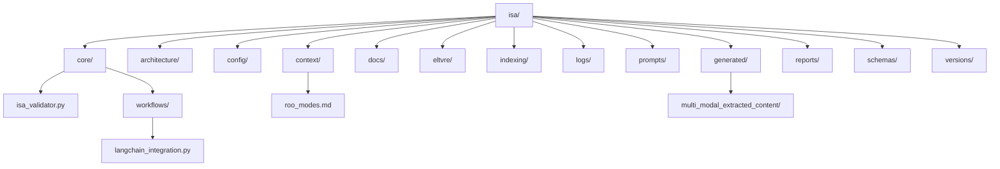

# Comprehensive Project Review and Standardization Plan

This plan outlines a strategy to standardize the project directory structure, update critical documentation, and map inter-module dependencies to enhance clarity and maintainability.

## Phase 1: Directory Structure Review and Standardization

**Goal:** To establish a consistent, logical, and maintainable project directory structure.

**Current Observations & Inconsistencies:**

*   `isa_validator.py` and `roo_modes.md` are located directly under `isa/`, which could be better organized into dedicated subdirectories.
*   The `isa/agentic_workflows/` directory contains `langchain_integration.py`, while `isa/architecture/agentic_workflows/` contains architectural documentation. This creates a slight ambiguity between implementation and documentation for workflows.
*   The `isa/prototype/multi_modal_understanding/extracted_content/` directory appears to contain generated content (images from PDF processing), which is typically separated from source code or prototypes.
*   The `isa/prompts/` directory contains various prompt files, some with versioning, which is good, but the overall organization can be reviewed for future scalability.

**Proposed Directory Renames/Relocations:**

1.  **Consolidate Agentic Workflows Implementation:**
    *   **Recommendation:** Move `isa/agentic_workflows/langchain_integration.py` to `isa/core/workflows/langchain_integration.py`.
    *   **Rationale:** This centralizes core workflow implementations under `isa/core/`, distinguishing them from architectural documentation located in `isa/architecture/agentic_workflows/`. A new `workflows` subdirectory under `core` will be created for this purpose.

2.  **Relocate Core Utilities:**
    *   **Recommendation:** Move `isa_validator.py` from `isa/` to `isa/core/isa_validator.py`.
    *   **Rationale:** `isa_validator.py` is a core utility for validating project consistency, and `isa/core/` is the appropriate location for such foundational components.

3.  **Relocate Mode Documentation:**
    *   **Recommendation:** Move `roo_modes.md` from `isa/` to `isa/context/roo_modes.md`.
    *   **Rationale:** This file provides contextual information about the system's modes, aligning it with other context-related documents in `isa/context/`.

4.  **Manage Generated Content:**
    *   **Recommendation:** Create a new top-level directory `isa/generated/` and move `isa/prototype/multi_modal_understanding/extracted_content/` to `isa/generated/multi_modal_extracted_content/`.
    *   **Rationale:** This separates generated or temporary content from source code and prototypes, leading to a cleaner and more focused `prototype` directory. This new `generated` directory should also be considered for inclusion in `.gitignore` if its contents are transient.

**Mermaid Diagram: Proposed ISA Directory Structure (High-Level)**



## Phase 2: Key Documentation Updates

**Goal:** To ensure all critical documentation reflects the standardized directory structure and recent project insights.

**Key Documentation Files to Update:**

The following files are identified as critical for updates:

*   [`isa_manifest.yaml`](isa_manifest.yaml)
*   [`isa/context/roadmap.md`](isa/context/roadmap.md)
*   [`isa/context/governance.md`](isa/context/governance.md)
*   [`isa/context/ISA_Roo_Definitive_Architecture_v1.md`](isa/context/ISA_Roo_Definitive_Architecture_v1.md)

**Update Strategy:**

1.  **Review and Revise:** For each of the identified documentation files, a thorough review will be conducted to identify any explicit or implicit references to the old directory structure.
2.  **Path and Description Alignment:** All outdated paths, directory descriptions, and architectural diagrams will be updated to accurately reflect the new standardized structure.
3.  **Consistency Check:** Ensure consistency in terminology, naming conventions, and architectural descriptions across all updated documents.
4.  **Mandatory Logging Updates:** As per global instructions, `CHANGELOG.md`, `isa/logs/agent_task_history.json`, `isa/versions/version_tracker.json`, `project_journal.md`, and `status_dashboard.md` will be automatically updated during the implementation phase to log these changes.

## Phase 3: Inter-Module Dependency Mapping and Analysis

**Goal:** To enhance architectural clarity by systematically mapping and analyzing dependencies between project modules.

**Identified Modules for Analysis:**

Based on the current and proposed structure, the primary modules within the `isa/` directory and other top-level code directories include:

*   `isa/core/` (including `workflows`)
*   `isa/eltvre/`
*   `isa/indexing/`
*   `isa/schemas/`
*   `src/ai/` (external to `isa/` but a key functional module)
*   `src/lib/` (external to `isa/` but a key functional module)
*   `isa/agentic_workflows/` (now primarily for architectural documentation)

**Dependency Analysis Strategy:**

1.  **Static Analysis (Primary Approach):**
    *   **Tool:** Utilize the `search_files` tool with regular expressions.
    *   **Methodology:**
        *   **Code Imports:** Scan all Python (`.py`), TypeScript (`.ts`), and JavaScript (`.js`) files within the identified modules for `import`, `from ... import`, `require()`, and similar statements. This will reveal direct code-level dependencies.
            *   *Example Regex (Python):* `^(?:from\s+([\w\.]+)\s+import|import\s+([\w\.]+))`
            *   *Example Regex (TypeScript/JavaScript):* `^(?:import\s+.*?\s+from\s+['"](.*?)['"]|require\(['"](.*?)['"]\))`
        *   **Configuration References:** Examine configuration files (e.g., `.json`, `.yaml`) and relevant markdown documents for explicit file paths or module names that indicate dependencies.
        *   **Schema Usage:** Trace where schemas defined in `isa/schemas/` are imported or referenced by other modules (e.g., in `src/ai/flows/` or `isa/core/workflows/`).

2.  **Documentation of Dependencies:**
    *   **New Document:** Create a new markdown file: `isa/architecture/module_dependencies.md`.
    *   **Content Structure:**
        *   **Module Overview:** A brief description of each identified module and its primary responsibilities.
        *   **Dependency Matrix/List:** For each module, explicitly list its direct dependencies on other modules.
        *   **Mermaid Dependency Graph:** Generate one or more Mermaid diagrams (e.g., component diagrams or dependency graphs) to visually represent the inter-module relationships. This will highlight the flow of control and data.
        *   **Analysis & Insights:** Document any identified circular dependencies, unexpected dependencies, or areas where dependencies could be refactored for better modularity.

**Mermaid Diagram: Inter-Module Dependency Mapping Strategy**

```mermaid
graph TD
    A[Start Dependency Mapping] --> B{Identify Core Modules};
    B --> C[Perform Static Analysis];
    C --> C1[Code Imports/Requires];
    C --> C2[Configuration References];
    C --> C3[Schema Usage];
    C --> D{Map Direct Dependencies};
    D --> E[Visualize Dependencies (Mermaid Diagrams)];
    E --> F[Document Findings in isa/architecture/module_dependencies.md];
    F --> G[Identify Circular/Unexpected Dependencies];
    G --> H[Propose Refinements (if any)];
    H --> I[End Dependency Mapping];