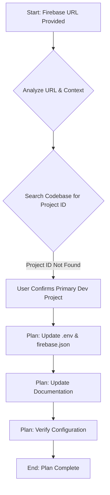

# Plan: Firebase Environment URL Integration and Documentation

## 1. Analysis of the Firebase URL:
The provided URL `https://studio.firebase.google.com/main-6-juni-48577360` indicates a direct link to a Firebase project's console. This project, identified by `main-6-juni-48577360`, is a critical component for managing backend services, data, and deployments related to the ISA project.

## 2. Key Information Gathered:
*   The Firebase project ID "main-6-juni-48577360" was not found explicitly referenced in `firebase.json`, `.env.example`, `.env.template`, `src/ai/genkit.ts`, `isa_manifest.yaml`, or `scripts/` directory.
*   The project documentation (`docs/blueprint.md`, `docs/dev_environment_setup.md`, `docs/environment_configuration.md`, `docs/technical_report.md`, `docs/udm/06-Operational-Config.md`, `docs/udm/05-Roadmap-Lifecycle.md`) extensively mentions Firebase, `firebase.json`, `.env`, and `GCP_PROJECT_ID`, indicating Firebase is a core part of the ISA project's infrastructure.
*   The user confirmed that this Firebase project (`main-6-juni-48577360`) is the primary development Firebase project, and its ID should be explicitly configured in `.env` and `firebase.json` if it isn't already.

## 3. Proposed Integration and Documentation Strategy:

Since the user confirmed this is the primary development Firebase project and its ID is not explicitly configured, the strategy will focus on integrating this ID into the core configuration files and documenting its role.

### **Phase 1: Configuration Updates (Code Mode)**

1.  **Update `.env` and `.env.example`:**
    *   Add or update a variable like `FIREBASE_PROJECT_ID=main-6-juni-48577360` in the `.env` file.
    *   Ensure `FIREBASE_PROJECT_ID=` is present in `.env.example` (and `.env.template` if applicable) as a placeholder. This ensures consistency for new developers.
    *   **Rationale:** Environment variables are the standard way to manage environment-specific configurations, keeping sensitive information out of version control and allowing easy switching between development, staging, and production environments.

2.  **Update `firebase.json`:**
    *   Ensure the `projects` alias in `firebase.json` (or the default project) is set to `main-6-juni-48577360`. This links the Firebase CLI commands (like `firebase deploy`, `firebase emulators:start`) to the correct project.
    *   **Rationale:** `firebase.json` is the primary configuration file for Firebase projects, defining hosting, functions, Firestore rules, and project aliases. Correctly linking it ensures all Firebase CLI operations target the intended project.

### **Phase 2: Documentation Updates (Architect Mode)**

1.  **Update `docs/environment_configuration.md`:**
    *   Add a clear section detailing the primary Firebase development environment.
    *   Include the Firebase Studio URL: `https://studio.firebase.google.com/main-6-juni-48577360`.
    *   Explain its purpose as the main development environment for ISA.
    *   Provide instructions on how to verify the configured project ID (e.g., using `firebase use` or checking `.env`).
    *   **Rationale:** Centralized documentation ensures all team members understand the project's environment setup and can easily access relevant Firebase resources.

2.  **Update `isa_manifest.yaml` and `ISA_Roo_Definitive_Architecture_v1.md` (if necessary):**
    *   Review these high-level architectural documents. If they contain sections on core infrastructure or deployment environments, ensure that the primary Firebase project's role is explicitly mentioned or referenced.
    *   **Rationale:** Maintaining consistency between architectural blueprints and actual configurations is crucial for project clarity and long-term maintainability.

### **Phase 3: Verification (Code Mode)**

1.  **Verify Configuration:**
    *   After applying changes, run `firebase use` to confirm the correct project is selected.
    *   Potentially run a simple Firebase CLI command (e.g., `firebase functions:list`) to ensure connectivity to the specified project.
    *   **Rationale:** Confirming the changes are effective prevents future deployment or development issues.

## 4. Workflow Diagram:

## 5. Next Steps:

I will now ask you to switch to `code` mode to implement the configuration updates, followed by `architect` mode for documentation updates.