# ISA Project: Comprehensive and Scalable Directory Structure Design

## 1. Executive Summary

This report outlines a comprehensive and scalable directory structure for the Intelligent Standards Assistant (ISA) project. The design emphasizes principles of maintainability, clarity, and efficient collaboration, providing a robust foundation for ISA's ongoing development and evolution. It details how various project artifacts—including requirements, design specifications, source code, test suites, and documentation—are related and interdependent, and how these interdependencies directly influence the optimal file and directory hierarchy. The proposed structure integrates established industry-standard patterns while adapting them to ISA's unique characteristics as an AI-driven, phased project with extensive documentation.

## 2. Analysis of Current Project Structure and Artifacts

The current ISA project exhibits a foundational structure, with key directories like `src/` for source code, `docs/` for documentation, and various `ISA_Future_Phases_...` directories indicating a phased development approach. The `isa/reports/documentation_structure_report.md` provided a detailed overview of existing Markdown files, highlighting the presence of a Unified Development Manual (UDM) within `docs/udm/` and numerous phase-specific documents.

**Key Observations:**
*   **Source Code:** Primarily in `src/`, with subdirectories for `app/` (Next.js frontend), `ai/` (Genkit flows, tools, schemas), `lib/` (utilities), and `components/` (UI).
*   **Documentation:** Centralized in `docs/`, with a strong emphasis on the UDM (`docs/udm/`) and various phase-specific documents (e.g., `isa/docs/phases/`, `ISA_Future_Phases_Full_Updated 2/`). There is some duplication of phase documentation across different `ISA_Future_Phases_` directories, suggesting historical versions or branches of planning.
*   **Configuration:** Files like `firebase.json`, `apphosting.yaml`, `package.json`, `.env.example` are present at the root or in relevant subdirectories.
*   **Reports/Logs:** `isa/reports/` and `isa/logs/` exist for generated outputs and operational logs.
*   **Data:** A conceptual `isa_data_sources/` is mentioned for raw documents.

The existing structure provides a good starting point but can be further optimized for clarity, consistency, and to explicitly support the project's long-term vision and autonomous development capabilities.

## 3. Core Principles for the New Structure

The proposed directory structure is guided by the following principles:

*   **Modularity:** Clearly separate distinct functional areas (e.g., frontend, AI backend, documentation, tests) to reduce coupling and improve maintainability.
*   **Discoverability:** Organize files intuitively so that developers and autonomous agents can easily locate relevant information and code.
*   **Scalability:** Design for future growth, accommodating new features, phases, and increasing data/model complexity without requiring major refactoring.
*   **Consistency:** Apply uniform naming conventions and organizational patterns across the project to reduce cognitive load.
*   **Traceability:** Enable clear links between related artifacts (e.g., requirements to design, design to code, code to tests, all to documentation).
*   **Automation-Friendly:** Structure the project to facilitate automated processes such as CI/CD pipelines, testing, documentation generation, and autonomous agent operations.
*   **Single Source of Truth:** Designate specific locations for canonical information (e.g., UDM for project knowledge, `isa_manifest.yaml` for project metadata).

## 4. Research and Evaluation of Industry-Standard Patterns

Several industry-standard project directory patterns were considered:

*   **Layered Architecture:** This is a common pattern for separating concerns (e.g., presentation, business logic, data access). ISA already partially follows this with `src/app` (presentation) and `src/ai` (business logic/AI). This pattern is highly suitable for ISA due to its distinct frontend, backend, and AI orchestration layers.
*   **Domain-Driven Design (DDD):** Organizing by business domains or features (e.g., `standards-analysis/`, `knowledge-graph/`). While beneficial for very large, complex systems, a strict DDD approach might be overkill for ISA's current scope and could introduce unnecessary nesting. However, elements of domain separation are useful within the `src/ai/flows` and `src/ai/tools` directories.
*   **Standard Project Layouts:** Common patterns like `src/`, `docs/`, `tests/`, `config/`, `scripts/`, `reports/` are widely adopted and provide immediate familiarity. This is the most suitable foundational pattern for ISA, as it balances clarity with flexibility.

**Adaptations for ISA:**
Given ISA's unique AI-driven, phased, and heavily documented nature, the standard project layout is adapted to include:
*   Dedicated directories for AI-specific artifacts (`src/ai/`, `models/`).
*   Comprehensive documentation structure (`docs/udm/`, `docs/phases/`).
*   Explicit directories for operational outputs (`logs/`, `reports/`, `versions/`).
*   A clear separation for development operations (`devops/`, `scripts/`).

## 5. Proposed Comprehensive Directory Structure for ISA

The following structure is proposed to provide a robust, scalable, and clear foundation for the ISA project:

```mermaid
graph TD
    A[ISA Project Root] --> B(config/);
    A --> C(docs/);
    A --> D(src/);
    A --> E(tests/);
    A --> F(scripts/);
    A --> G(data/);
    A --> H(models/);
    A --> I(logs/);
    A --> J(reports/);
    A --> K(versions/);
    A --> L(devops/);
    A --> M(.vscode/);
    A --> N(CHANGELOG.md);
    A --> O(README.md);
    A --> P(.env);
    A --> Q(.env.example);
    A --> R(.gitignore);
    A --> S(package.json);
    A --> T(package-lock.json);
    A --> U(firebase.json);
    A --> V(apphosting.yaml);
    A --> W(firestore.indexes.json);
    A --> X(firestore.rules);
    A --> Y(next.config.ts);
    A --> Z(tsconfig.json);
    A --> AA(isa_manifest.yaml);

    C --> C1(docs/udm/);
    C --> C2(docs/phases/);
    C --> C3(docs/architecture/);
    C --> C4(docs/requirements/);
    C --> C5(docs/reports/);
    C --> C6(docs/security/);
    C --> C7(docs/notes/);

    D --> D1(src/app/);
    D --> D2(src/ai/);
    D --> D3(src/lib/);
    D --> D4(src/components/);

    D2 --> D2_1(src/ai/flows/);
    D2 --> D2_2(src/ai/tools/);
    D2 --> D2_3(src/ai/schemas/);
    D2 --> D2_4(src/ai/prompts/);

    G --> G1(data/raw/);
    G --> G2(data/processed/);
    G --> G3(data/mock/);

    I --> I1(logs/agent_task_history.json);
    I --> I2(logs/venv_issues.log);
    I --> I3(logs/audits/);
    I --> I4(logs/tasks/);
    I --> I5(logs/research/);
    I --> I6(logs/milestones/);
    I --> I7(logs/knowledge_gaps/);

    J --> J1(reports/documentation_structure_report.md);
    J --> J2(reports/documentation_review_report.md);
    J --> J3(reports/status_dashboard.md);
    J --> J4(reports/roo_health_report.json);

    K --> K1(versions/snapshots/);
    K --> K2(versions/version_tracker.json);

    L --> L1(devops/ci-cd/);
    L --> L2(devops/scripts/);
    L --> L3(devops/secrets/);

    style A fill:#f9f,stroke:#333,stroke-width:2px;
    style B fill:#ccf,stroke:#333,stroke-width:1px;
    style C fill:#ccf,stroke:#333,stroke-width:1px;
    style D fill:#ccf,stroke:#333,stroke-width:1px;
    style E fill:#ccf,stroke:#333,stroke-width:1px;
    style F fill:#ccf,stroke:#333,stroke-width:1px;
    style G fill:#ccf,stroke:#333,stroke-width:1px;
    style H fill:#ccf,stroke:#333,stroke-width:1px;
    style I fill:#ccf,stroke:#333,stroke-width:1px;
    style J fill:#ccf,stroke:#333,stroke-width:1px;
    style K fill:#ccf,stroke:#333,stroke-width:1px;
    style L fill:#ccf,stroke:#333,stroke-width:1px;
    style M fill:#ccf,stroke:#333,stroke-width:1px;
    style N fill:#e0e0e0,stroke:#666,stroke-width:1px;
    style O fill:#e0e0e0,stroke:#666,stroke-width:1px;
    style P fill:#e0e0e0,stroke:#666,stroke-width:1px;
    style Q fill:#e0e0e0,stroke:#666,stroke-width:1px;
    style R fill:#e0e0e0,stroke:#666,stroke-width:1px;
    style S fill:#e0e0e0,stroke:#666,stroke-width:1px;
    style T fill:#e0e0e0,stroke:#666,stroke-width:1px;
    style U fill:#e0e0e0,stroke:#666,stroke-width:1px;
    style V fill:#e0e0e0,stroke:#666,stroke-width:1px;
    style W fill:#e0e0e0,stroke:#666,stroke-width:1px;
    style X fill:#e0e0e0,stroke:#666,stroke-width:1px;
    style Y fill:#e0e0e0,stroke:#666,stroke-width:1px;
    style Z fill:#e0e0e0,stroke:#666,stroke-width:1px;
    style AA fill:#e0e0e0,stroke:#666,stroke-width:1px;

    style C1 fill:#afa,stroke:#333,stroke-width:1px;
    style C2 fill:#afa,stroke:#333,stroke-width:1px;
    style C3 fill:#afa,stroke:#333,stroke-width:1px;
    style C4 fill:#afa,stroke:#333,stroke-width:1px;
    style C5 fill:#afa,stroke:#333,stroke-width:1px;
    style C6 fill:#afa,stroke:#333,stroke-width:1px;
    style C7 fill:#afa,stroke:#333,stroke-width:1px;

    style D1 fill:#bbf,stroke:#333,stroke-width:1px;
    style D2 fill:#bbf,stroke:#333,stroke-width:1px;
    style D3 fill:#bbf,stroke:#333,stroke-width:1px;
    style D4 fill:#bbf,stroke:#333,stroke-width:1px;

    style D2_1 fill:#ddf,stroke:#333,stroke-width:1px;
    style D2_2 fill:#ddf,stroke:#333,stroke-width:1px;
    style D2_3 fill:#ddf,stroke:#333,stroke-width:1px;
    style D2_4 fill:#ddf,stroke:#333,stroke-width:1px;

    style G1 fill:#e6e6e6,stroke:#999,stroke-width:1px;
    style G2 fill:#e6e6e6,stroke:#999,stroke-width:1px;
    style G3 fill:#e6e6e6,stroke:#999,stroke-width:1px;

    style I1 fill:#e6e6e6,stroke:#999,stroke-width:1px;
    style I2 fill:#e6e6e6,stroke:#999,stroke-width:1px;
    style I3 fill:#e6e6e6,stroke:#999,stroke-width:1px;
    style I4 fill:#e6e6e6,stroke:#999,stroke-width:1px;
    style I5 fill:#e6e6e6,stroke:#999,stroke-width:1px;
    style I6 fill:#e6e6e6,stroke:#999,stroke-width:1px;
    style I7 fill:#e6e6e6,stroke:#999,stroke-width:1px;

    style J1 fill:#e6e6e6,stroke:#999,stroke-width:1px;
    style J2 fill:#e6e6e6,stroke:#999,stroke-width:1px;
    style J3 fill:#e6e6e6,stroke:#999,stroke-width:1px;
    style J4 fill:#e6e6e6,stroke:#999,stroke-width:1px;

    style K1 fill:#e6e6e6,stroke:#999,stroke-width:1px;
    style K2 fill:#e6e6e6,stroke:#999,stroke-width:1px;

    style L1 fill:#e6e6e6,stroke:#999,stroke-width:1px;
    style L2 fill:#e6e6e6,stroke:#999,stroke-width:1px;
    style L3 fill:#e6e6e6,stroke:#999,stroke-width:1px;
```

**Detailed Directory Breakdown:**

*   **`/` (Project Root):** Contains top-level project files like `README.md`, `CHANGELOG.md`, configuration files (`package.json`, `firebase.json`, `apphosting.yaml`, `.env`), and the `isa_manifest.yaml` for overall project metadata.
*   **`/.vscode/`:** Visual Studio Code specific settings, launch configurations, and extensions recommendations.
*   **`/config/`:** Global application configurations, environment-specific settings (beyond `.env`), and potentially shared configuration schemas.
*   **`/docs/`:** Comprehensive project documentation.
    *   **`/docs/udm/`:** The Unified Development Manual (UDM), serving as the central, living constitution of ISA. Numbered sections (e.g., `00-UDM-Meta.md`, `01-Core-Mandate.md`, `02-System-Architecture.md`, `03-Knowledge-Data-Management.md`, `04-Roo-Modes.md`, `05-Roadmap-Lifecycle.md`, `06-Operational-Config.md`, `07-Testing-QA.md`, `08-Security-Compliance-Ethics.md`, `09-Evolution-Protocol.md`, `10-Glossary.md`, `11-Appendices.md`) ensure a logical flow and easy referencing.
    *   **`/docs/phases/`:** Detailed documentation for each development phase (e.g., `phase_8_federated_learning.md`, `phase_9_multi_objective_reasoning.md`). This centralizes phase-specific information, avoiding duplication found in current `ISA_Future_Phases_` directories.
    *   **`/docs/architecture/`:** High-level architectural designs, system diagrams, component breakdowns, and design decisions.
    *   **`/docs/requirements/`:** Functional and non-functional requirements, user stories, and use cases.
    *   **`/docs/reports/`:** Static or manually generated reports that are part of the documentation.
    *   **`/docs/security/`:** Security policies, guidelines, and audit summaries.
    *   **`/docs/notes/`:** Scratchpad or temporary notes.
*   **`/src/`:** All application source code.
    *   **`/src/app/`:** Next.js application structure, including pages, layouts, and API routes (Server Actions).
    *   **`/src/ai/`:** Core AI logic and Genkit framework components.
        *   **`/src/ai/flows/`:** Genkit AI flows (e.g., `answer-gs1-questions.ts`, `detect-standard-errors.ts`).
        *   **`/src/ai/tools/`:** Custom Genkit tools (e.g., `vector-store-tools.ts`, `knowledge-graph-tools.ts`).
        *   **`/src/ai/schemas/`:** Zod schemas for AI flow inputs/outputs and data structures.
        *   **`/src/ai/prompts/`:** AI prompt templates used by Genkit flows.
    *   **`/src/lib/`:** Shared utility functions, helper modules, common types, and core business logic not directly tied to UI or AI flows.
    *   **`/src/components/`:** Reusable UI components (e.g., ShadCN UI components).
*   **`/tests/`:** All test suites (unit, integration, end-to-end). Organized mirroring the `src/` structure.
*   **`/scripts/`:** Utility scripts for development, build, and deployment tasks (e.g., `setup.sh`, `configure_firebase.sh`).
*   **`/data/`:** Data assets used by the project.
    *   **`/data/raw/`:** Raw, unprocessed data (e.g., `isa_data_sources/gs1_standard_docs_raw/`).
    *   **`/data/processed/`:** Processed or transformed data ready for consumption (e.g., chunked documents, extracted entities).
    *   **`/data/mock/`:** Mock data for development and testing.
*   **`/models/`:** Trained AI models, embeddings, or model-related artifacts (if not managed directly by Vertex AI).
*   **`/logs/`:** Runtime logs, agent execution logs, and audit trails.
    *   **`/logs/agent_task_history.json`:** Log of all agent tasks.
    *   **`/logs/venv_issues.log`:** Virtual environment validation logs.
    *   **`/logs/audits/`:** Reports from audit tasks (e.g., config, structure, codebase audits).
    *   **`/logs/tasks/`:** Detailed logs for individual tasks.
    *   **`/logs/research/`:** Logs and summaries from research tasks.
    *   **`/logs/milestones/`:** Milestone completion reports.
    *   **`/logs/knowledge_gaps/`:** Knowledge gap assessment reports.
*   **`/reports/`:** Generated reports and dashboards (e.g., `documentation_structure_report.md`, `status_dashboard.md`, `roo_health_report.json`). These are distinct from `docs/reports/` which might contain more static, manually curated reports.
*   **`/versions/`:** Project versioning artifacts.
    *   **`/versions/snapshots/`:** Codebase snapshots at key milestones.
    *   **`/versions/version_tracker.json`:** Automated version tracking.
*   **`/devops/`:** DevOps-related configurations and scripts.
    *   **`/devops/ci-cd/`:** CI/CD pipeline definitions (e.g., GitHub Actions, Cloud Build).
    *   **`/devops/scripts/`:** DevOps-specific automation scripts.
    *   **`/devops/secrets/`:** Guidance and templates for secrets management.

## 6. Interdependencies and Influence on Hierarchy

The proposed structure is designed to explicitly manage and leverage the interdependencies between project artifacts:

*   **Requirements (`docs/requirements/`) -> Design (`docs/architecture/`) -> Code (`src/`):** The clear separation allows for a top-down flow. Requirements define *what* needs to be built, architecture defines *how* it will be built, and `src/` contains the actual implementation. This structure facilitates tracing a feature from its initial requirement through design to its code.
*   **Code (`src/`) -> Tests (`tests/`):** The mirroring of the `src/` structure within `tests/` ensures that tests are easily discoverable and directly associated with the code they validate.
*   **Documentation (`docs/`) as Central Context:** The `docs/udm/` serves as the overarching knowledge base, providing context for all other directories. For example, `docs/udm/02-System-Architecture.md` describes the components implemented in `src/`, and `docs/udm/05-Roadmap-Lifecycle.md` outlines the phases detailed in `docs/phases/`.
*   **AI Artifacts (`src/ai/`, `data/`, `models/`) and their Interplay:** `src/ai/flows` orchestrate `src/ai/tools` which might interact with data in `data/` or models in `models/`. `src/ai/schemas` provides the contracts for these interactions. This grouping ensures all AI-related components are co-located and their dependencies are clear.
*   **Configuration (`config/`, root config files) -> Deployment (`devops/`, `apphosting.yaml`):** Configuration files define how the application behaves and is deployed. Placing global configurations in `config/` and deployment-specific ones in `devops/` or at the root (for standard project configs) ensures clarity.
*   **Logs and Reports (`logs/`, `reports/`) -> Traceability:** Dedicated directories for logs and reports ensure that all operational outputs, audit trails, and generated insights are systematically stored and easily accessible for review, debugging, and performance monitoring, crucial for an autonomous agent.
*   **Versions (`versions/`) -> Project Evolution:** Storing snapshots and version tracking data allows for historical analysis, rollbacks, and clear understanding of project evolution over time.

## 7. Evaluation of Suitability and Adaptations for ISA

The proposed structure is highly suitable for ISA due to its:

*   **Strong Support for AI-Driven Development:** The explicit `src/ai/` directory with its sub-components (`flows`, `tools`, `schemas`, `prompts`) directly supports Genkit-based AI orchestration. The `data/` and `models/` directories are essential for managing AI knowledge bases and trained models.
*   **Clear Phased Roadmap Integration:** The `docs/phases/` directory provides a dedicated, centralized location for detailed phase documentation, directly aligning with ISA's multi-phase development strategy. This resolves the current fragmentation of phase information.
*   **Emphasis on Comprehensive Documentation:** The `docs/udm/` as the "single source of truth" for project knowledge is a core strength, enabling both human developers and autonomous agents (like Roo) to consistently understand the project's mandate, architecture, and operational guidelines.
*   **Facilitation of Autonomous Agent Operations:** The structured `logs/` and `reports/` directories are critical for Roo's self-monitoring, auditing, and decision-making processes. The clear organization of prompts (`src/ai/prompts/` and potentially `isa/prompts/` for system-level prompts) is vital for prompt engineering and versioning.
*   **Scalability:** The modular design allows for independent growth of different components (e.g., adding new AI flows, expanding documentation, integrating more data sources) without impacting the overall structure.
*   **Maintainability and Collaboration:** The logical grouping of files and clear naming conventions enhance readability and make it easier for multiple contributors (human or AI) to work on different parts of the project concurrently.

**Adaptations from Standard Patterns:**
The primary adaptation is the increased granularity and explicit naming within the `docs/` and `src/ai/` directories, and the dedicated `data/`, `models/`, `logs/`, `reports/`, and `versions/` directories. While standard projects might lump some of these, ISA's complexity and autonomous nature necessitate this level of detail for effective management and operation. The `isa/` directory at the root is reserved for core ISA-specific internal tools or frameworks that might not fit neatly into `src/` (e.g., internal agent management utilities, if they evolve beyond the main application).

This comprehensive directory structure provides a robust, clear, and scalable foundation for the ISA project, supporting its ambitious goals and autonomous development paradigm.