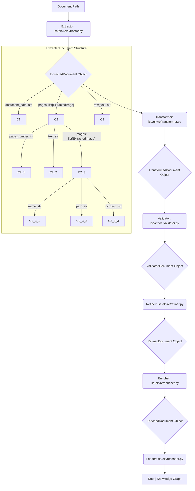

## Plan: Multi-Modal Understanding Integration into ELTVRE Pipeline

### 1. Introduction

This plan outlines the integration of multi-modal understanding, specifically PDF processing capabilities from `isa/prototype/multi_modal_understanding/pdf_processor.py`, into the existing ELTVRE (Extractor, Transformer, Validator, Refiner, Enricher, Loader) pipeline, focusing on `isa/eltvre/extractor.py`. The goal is to enable the ingestion of both textual and image-based content (including OCR'd text) from documents into the Neo4j knowledge graph, while ensuring a robust, extensible, and error-resilient data flow.

### 2. Current State Analysis

*   **`isa/prototype/multi_modal_understanding/pdf_processor.py`**: This script provides the core functionality for extracting text and images from PDFs, and performing OCR on the extracted images. It returns a list of dictionaries, each representing a page with its text and a list of image details (name, path, OCR text).
*   **`isa/eltvre/extractor.py`**: Currently a placeholder, `extract_content` simply returns a string. It needs to be enhanced to handle different document types and integrate the PDF processing logic.
*   **ELTVRE Pipeline**: The subsequent stages (Transformer, Validator, Refiner, Enricher, Loader) currently expect a textual input. The data structure passed between these stages will need to be updated to accommodate multi-modal content.
*   **Neo4j Knowledge Graph**: The existing schema needs to be considered for mapping multi-modal data.

### 3. Detailed Integration Plan

#### 3.1. Modification of `extractor.py`

The `extractor.py` will be refactored to act as a dispatcher for various document types. It will leverage the `pdf_processor.py` for PDF documents.

**Proposed Changes:**

1.  **Import `pdf_processor`**:
    ```python
    # isa/eltvre/extractor.py
    from isa.prototype.multi_modal_understanding.pdf_processor import extract_images_and_text_from_pdf
    import os
    ```
2.  **Enhance `extract_content` function**:
    *   The function signature will be updated to return a structured `ExtractedDocument` object (defined below) instead of a raw string.
    *   It will determine the document type based on the file extension.
    *   For `.pdf` files, it will call `extract_images_and_text_from_pdf`.
    *   For other types (e.g., `.txt`, `.html`, `.md`), it will use existing or new placeholder logic.
    *   A new `ExtractedDocument` class will be introduced to standardize the output.

    ```python
    # isa/eltvre/extractor.py

    class ExtractedImage:
        def __init__(self, name: str, path: str, ocr_text: str = "", original_bytes: bytes = None):
            self.name = name
            self.path = path
            self.ocr_text = ocr_text
            self.original_bytes = original_bytes # Optional: for direct image processing later

    class ExtractedPage:
        def __init__(self, page_number: int, text: str = "", images: list[ExtractedImage] = None):
            self.page_number = page_number
            self.text = text
            self.images = images if images is not None else []

    class ExtractedDocument:
        def __init__(self, document_path: str, pages: list[ExtractedPage] = None, raw_text: str = ""):
            self.document_path = document_path
            self.pages = pages if pages is not None else []
            self.raw_text = raw_text # For non-paged documents or aggregated text

    def extract_content(document_path: str) -> ExtractedDocument:
        """
        Extracts content from various document types, including multi-modal data from PDFs.
        Returns a structured ExtractedDocument object.
        """
        print(f"Extracting content from {document_path}")
        file_extension = os.path.splitext(document_path)[1].lower()
        
        extracted_doc = ExtractedDocument(document_path=document_path)

        if file_extension == ".pdf":
            try:
                pdf_data = extract_images_and_text_from_pdf(document_path)
                for page_data in pdf_data:
                    extracted_images = [
                        ExtractedImage(
                            name=img_info['name'],
                            path=img_info['path'],
                            ocr_text=img_info['ocr_text']
                        ) for img_info in page_data['images']
                    ]
                    extracted_doc.pages.append(
                        ExtractedPage(
                            page_number=page_data['page_number'],
                            text=page_data['text'],
                            images=extracted_images
                        )
                    )
                # Aggregate all text for overall document context
                extracted_doc.raw_text = "\n".join([page.text for page in extracted_doc.pages])
                extracted_doc.raw_text += "\n".join([img.ocr_text for page in extracted_doc.pages for img in page.images])

            except Exception as e:
                print(f"Error processing PDF {document_path}: {e}")
                # Depending on error handling strategy, might raise, log, or return partial data
                # For now, we'll return an empty ExtractedDocument with an error flag/log.
                # More robust error handling will be detailed in section 3.4.
                extracted_doc.raw_text = f"Error extracting content from PDF: {e}"
        elif file_extension in [".txt", ".md", ".html"]:
            # Placeholder for other document types
            with open(document_path, 'r', encoding='utf-8') as f:
                extracted_doc.raw_text = f.read()
        else:
            print(f"Unsupported document type: {file_extension}")
            extracted_doc.raw_text = f"Unsupported document type: {file_extension}"
        
        return extracted_doc
    ```

#### 3.2. Data Flow through ELTVRE Stages

The `ExtractedDocument` object will be the primary data structure passed between all stages of the ELTVRE pipeline. Each stage will operate on this object, modifying or enriching its contents.

**Data Flow Representation:**



**Stage-specific Responsibilities:**

*   **Extractor**: Produces the initial `ExtractedDocument` with raw text and image data (including OCR).
*   **Transformer**: Processes the `ExtractedDocument`.
    *   Can perform text cleaning, normalization, entity recognition on `page.text` and `image.ocr_text`.
    *   Could potentially generate embeddings for images or OCR text.
    *   Output: `TransformedDocument` (an `ExtractedDocument` with processed content).
*   **Validator**: Checks the `TransformedDocument` for data quality, consistency, and adherence to schema rules.
    *   Ensures extracted entities are valid.
    *   Flags or removes malformed data.
    *   Output: `ValidatedDocument` (an `ExtractedDocument` with validation flags/corrections).
*   **Refiner**: Further refines the `ValidatedDocument`.
    *   Resolves ambiguities, de-duplicates entities, links to existing knowledge.
    *   Could use LLMs to summarize or extract higher-level concepts from text/OCR.
    *   Output: `RefinedDocument` (an `ExtractedDocument` with refined entities/relationships).
*   **Enricher**: Adds external context or derived information to the `RefinedDocument`.
    *   Fetches additional data based on extracted entities (e.g., from external APIs).
    *   Generates new insights or relationships.
    *   Output: `EnrichedDocument` (an `ExtractedDocument` with enriched data).
*   **Loader**: Takes the `EnrichedDocument` and maps it to the Neo4j schema, creating nodes and relationships.

#### 3.3. Schema Mapping to Neo4j Knowledge Graph

The multi-modal data will be mapped to the Neo4j knowledge graph schema as follows:

*   **Document Node**: Each processed document will be represented as a `Document` node.
    *   Properties: `document_path`, `title` (extracted by Transformer/Refiner), `ingestion_date`.
*   **Page Nodes**: For PDF documents, each page can be represented as a `Page` node.
    *   Properties: `page_number`, `text_content` (from `page.text`).
    *   Relationships: `(Document)-[:HAS_PAGE]->(Page)`.
*   **Image Nodes**: Each extracted image will be represented as an `Image` node.
    *   Properties: `image_name`, `image_path` (local storage path), `ocr_text`.
    *   Relationships:
        *   `(Page)-[:CONTAINS_IMAGE]->(Image)` (if image is on a specific page).
        *   `(Document)-[:HAS_IMAGE]->(Image)` (if image is document-wide or not page-specific).
*   **Textual Entities**: Entities extracted from `page.text` or `image.ocr_text` (e.g., persons, organizations, concepts) will be represented as their respective nodes (e.g., `Person`, `Organization`, `Concept`).
    *   Relationships: `(Page)-[:MENTIONS]->(Person)`, `(Image)-[:DESCRIBES]->(Concept)`.
*   **Relationships**: Relationships between entities will be created based on the semantic understanding derived from the text and OCR content.

**Example Cypher Snippets (Conceptual):**

```cypher
// Create Document Node
MERGE (d:Document {path: $document_path})
SET d.title = $title, d.ingestion_date = datetime()

// Create Page Node and link to Document
MERGE (p:Page {document_path: $document_path, page_number: $page_number})
SET p.text_content = $page_text
MERGE (d)-[:HAS_PAGE]->(p)

// Create Image Node and link to Page
MERGE (img:Image {name: $image_name, path: $image_path})
SET img.ocr_text = $ocr_text
MERGE (p)-[:CONTAINS_IMAGE]->(img)

// Create/Merge Textual Entity and link to Page/Image
MERGE (e:Entity {name: $entity_name})
MERGE (p)-[:MENTIONS]->(e)
// OR
MERGE (img)-[:DESCRIBES]->(e)
```

#### 3.4. Error Handling

Robust error handling is crucial for a resilient pipeline.

**Strategies:**

1.  **Granular Exception Handling**:
    *   In `extractor.py`, specifically wrap calls to `PyPDF2` and `pytesseract` in `try-except` blocks.
    *   Catch specific exceptions (e.g., `PyPDF2.errors.PdfReadError`, `pytesseract.TesseractNotFoundError`).
2.  **Logging**:
    *   Log all errors, warnings, and critical failures to `isa/logs/eltvre_errors.log`.
    *   Include document path, stage of failure, error message, and timestamp.
3.  **Error Reporting in `ExtractedDocument`**:
    *   The `ExtractedDocument` object can include an `errors` field (e.g., a list of strings or a dictionary) to propagate error information downstream.
    *   This allows subsequent stages to decide how to proceed (e.g., skip processing, attempt partial processing).
4.  **Fallback Mechanisms**:
    *   If OCR fails for an image, store the image path and a flag indicating OCR failure, allowing manual review or later re-processing.
    *   If PDF parsing fails, log the error and potentially store the raw PDF for manual inspection, preventing pipeline blockage.
5.  **Dead Letter Queue (Future Consideration)**: For persistent failures, a dead letter queue mechanism could be implemented where problematic documents are moved for later analysis or manual intervention.
6.  **Validation Stage Role**: The Validator stage will play a key role in identifying and handling data quality issues arising from extraction or transformation errors.

#### 3.5. Future Expansion

The proposed `ExtractedDocument` structure and the modular approach in `extractor.py` lay the groundwork for future expansion to other multi-modal data types.

**Extensibility Considerations:**

1.  **Modular Extractors**:
    *   Create new extractor functions (e.g., `extract_audio_content`, `extract_video_content`) for each new modality.
    *   These functions would reside in their own modules (e.g., `isa/prototype/multi_modal_understanding/audio_processor.py`, `video_processor.py`).
    *   `extractor.py` would simply add new `elif` conditions to its dispatch logic based on file extension or MIME type.
2.  **Flexible `ExtractedDocument`**:
    *   The `ExtractedDocument` class is designed to be flexible. New fields can be added to `ExtractedDocument`, `ExtractedPage`, or new sub-classes (e.g., `ExtractedAudioSegment`, `ExtractedVideoFrame`) can be introduced as needed.
    *   For example, for audio, `ExtractedDocument` could have a `segments: list[ExtractedAudioSegment]` field, where each segment contains `transcript`, `speaker_id`, `start_time`, `end_time`.
3.  **Generic Processing in ELTVRE Stages**:
    *   The Transformer, Validator, Refiner, and Enricher stages should be designed to operate on the `ExtractedDocument` object in a generic way where possible, or to dispatch to modality-specific sub-processors.
    *   For example, a `Transformer` might have a `transform_text(text)` method and a `transform_image(image_data)` method.
4.  **Schema Evolution**:
    *   The Neo4j schema will need to evolve to accommodate new nodes and relationships for audio, video, and other modalities (e.g., `AudioSegment` nodes, `VideoFrame` nodes, relationships like `[:HAS_TRANSCRIPT]`, `[:DEPICTS]`).

### 4. Implementation Steps (for `code` mode agent)

1.  **Refactor `isa/eltvre/extractor.py`**:
    *   Define the `ExtractedImage`, `ExtractedPage`, and `ExtractedDocument` classes.
    *   Modify the `extract_content` function to implement the dispatch logic and integrate `extract_images_and_text_from_pdf`.
2.  **Update ELTVRE Stage Signatures**:
    *   Modify the function signatures of `transformer.py`, `validator.py`, `refiner.py`, `enricher.py`, and `loader.py` to accept and return `ExtractedDocument` objects.
    *   Initially, these stages can simply pass the `ExtractedDocument` through without complex processing, focusing on the data structure change.
3.  **Implement Basic Processing in ELTVRE Stages**:
    *   In `transformer.py`, add placeholder logic to access `ExtractedDocument.raw_text` and `ExtractedPage.text` and `ExtractedImage.ocr_text`.
    *   In `loader.py`, implement basic Neo4j node creation for `Document`, `Page`, and `Image` nodes based on the `ExtractedDocument` structure.
4.  **Add Error Handling**:
    *   Implement `try-except` blocks in `extractor.py` for PDF processing.
    *   Add basic logging for errors.
5.  **Testing**:
    *   Create unit tests for `extractor.py` to ensure correct PDF processing and data structure output.
    *   Create integration tests for the entire ELTVRE pipeline with a sample PDF.

### 5. Conclusion

This plan provides a comprehensive approach to integrating multi-modal understanding into the ISA knowledge graph ingestion pipeline. By standardizing the data flow with the `ExtractedDocument` object and designing for modularity, the system will be capable of processing diverse document types and easily extensible for future modalities. The detailed steps will guide the `code` mode agent in implementing this critical functionality.