## Project Initial Scan Report: Intelligent Standards Assistant (ISA)

### 1. Project Overview

The project, identified as the "Intelligent Standards Assistant (ISA)," exhibits a highly sophisticated and modular architecture, primarily focused on AI-driven functionalities, data processing, and knowledge management. It leverages a multi-language stack, prominently featuring Python for core logic and data pipelines, and TypeScript/JavaScript for potential frontend components and AI tooling. The project demonstrates a strong commitment to structured development, comprehensive documentation, and robust CI/CD practices.

### 2. Key Project Components and Technologies

Based on the directory scan, the following key components and technologies are identified:

*   **Core AI & Agentic Frameworks:**
    *   **Python-based Core:** `isa/core/` contains `model_manager.py`, `isa_summarizer.py`, `run_semantic_search.py`, and `isa_validator.py`, indicating central functionalities for AI model management, summarization, semantic search, and project validation.
    *   **LangChain Integration:** `isa/agentic_workflows/langchain_integration.py` points to the use of LangChain for orchestrating AI agents and workflows.
    *   **AI Flows:** `src/ai/flows/` includes specialized AI functionalities like `analyze-standards.ts`, `answer-gs1-questions-with-vector-search.ts`, `conduct-independent-research.ts`, `natural-language-to-formal-description.ts`, and `detect-standard-errors.ts`.
    *   **AI Tools:** `src/ai/tools/` contains `knowledge-graph-tools.ts` and `vector-store-tools.ts`, suggesting custom tools for AI agents interacting with knowledge graphs and vector databases.

*   **Data Processing & Management:**
    *   **ELTVRE Pipeline:** A prominent `isa/pipelines/eltvre/` directory houses a comprehensive Extract, Load, Transform, Validate, Refine, Enrich pipeline (`01_extract.py` to `06_enrich.py`), complete with tests and a runner script. This is a critical data processing backbone.
    *   **Vector Data Storage:** `isa/architecture/vector_data_storage.md` indicates the use of vector databases for efficient similarity search, likely supporting semantic search and AI functionalities.
    *   **Knowledge Graph:** `isa/architecture/knowledge_graph_mode_design.md` and `src/ai/tools/knowledge-graph-tools.ts` confirm the integration of a knowledge graph for structured data representation and reasoning.
    *   **Indexing:** `isa/indexing/` contains `text_chunker.py` and `file_extractor.py`, suggesting processes for preparing data for indexing and search.
    *   **DataConnect:** `dataconnect/` and `dataconnect-generated/` directories imply the use of a data connection service, possibly for integrating various data sources.

*   **Architectural & Infrastructure:**
    *   **Model Context Protocol (MCP):** Extensive presence of `Cline/MCP/sqlite-mcp-server/servers/src/` with various MCP server implementations (e.g., `github/`, `memory/`, `document-ai/`, `sequentialthinking/`) indicates a highly modular, microservices-oriented architecture where different functionalities are exposed as tools via MCP.
    *   **Federated LLMs:** `isa/architecture/federated_llm_nodes.md` suggests a distributed approach to LLM deployment and utilization.
    *   **Firebase Integration:** `firebase.json` and `Intelligent Standards Assistant (ISA) - Firebase Studio_files/` point to Firebase as a backend platform, potentially for hosting, authentication, or database services.
    *   **DevOps & CI/CD:** `devops/`, `isa_devops_ci_cd_v4/`, and `.github/workflows/` (e.g., `ci.yml`, `deploy-nextjs.yml`) demonstrate a robust DevOps setup with automated testing and deployment.
    *   **IAM Infrastructure:** `iam_infra/` suggests dedicated infrastructure for Identity and Access Management.

*   **Documentation & Project Management:**
    *   **Extensive Documentation:** `docs/` and `isa/docs/` contain a wealth of information, including `blueprint.md`, `testing_guidelines.md`, `environment_configuration.md`, and detailed phase documentation (`isa/docs/phases/`).
    *   **Reporting & Auditing:** `isa/reports/` is rich with various reports and plans (e.g., `isa_360_audit_report.md`, `status_dashboard.md`, `project_development_phases_report.md`), indicating a strong emphasis on project visibility and quality assurance.
    *   **Version Control & Logging:** `CHANGELOG.md`, `isa/versions/version_tracker.json`, `isa/logs/agent_task_history.json`, and `project_journal.md` highlight meticulous version tracking and comprehensive logging.
    *   **Project Structure & Contribution:** `README.md`, `PROJECT_STRUCTURE.md`, `CONTRIBUTING.md`, and `.github/ISSUE_TEMPLATE/` provide essential guidance for project understanding and collaboration.

### 3. Project Structure Diagram

```mermaid
graph TD
    A[ISA Project Root] --> B(Documentation & Governance)
    A --> C(Core AI & Agentic Systems)
    A --> D(Data Pipelines & Knowledge Management)
    A --> E(Infrastructure & DevOps)
    A --> F(Frontend/Application Layer)

    B --> B1[docs/]
    B --> B2[isa/context/]
    B --> B3[isa/reports/]
    B --> B4[CHANGELOG.md]
    B --> B5[README.md]

    C --> C1[isa/core/]
    C --> C2[isa/agentic_workflows/]
    C --> C3[src/ai/flows/]
    C --> C4[src/ai/tools/]
    C --> C5[isa/prompts/]

    D --> D1[isa/pipelines/eltvre/]
    D --> D2[isa/architecture/vector_data_storage.md]
    D --> D3[isa/architecture/knowledge_graph_mode_design.md]
    D --> D4[isa/indexing/]
    D --> D5[dataconnect/]

    E --> E1[Cline/MCP/]
    E --> E2[iam_infra/]
    E --> E3[.github/workflows/]
    E --> E4[firebase.json]
    E --> E5[devops/]

    F --> F1[src/]
    F --> F2[package.json]
    F --> F3[next.config.js]
    F --> F4[jest.config.js]

    subgraph Historical/Phased Development
        G[github-ready-ISA-PhaseX/]
        H[ISA_Future_Phases/]
        I[ISA_Updated_Phase_Package/]
    end
```

### 4. Suggested Next Steps for Development

Based on this initial scan, here are potential areas for continued development, prioritized by their likely impact on project coherence, stability, and future capabilities:

1.  **Project Consolidation and Cleanup:**
    *   **Action:** Investigate and consolidate the numerous `ISA_PhaseX` and `github-ready-ISA` directories. Determine if these are historical snapshots, unmerged branches, or parallel development efforts.
    *   **Rationale:** A streamlined project structure will reduce confusion, improve maintainability, and ensure all development efforts are aligned with the current, active codebase. This is crucial before any significant feature development.

2.  **Deep Dive into ELTVRE Pipeline Optimization and Expansion:**
    *   **Action:** Focus on optimizing the performance and scalability of the ELTVRE pipeline (`isa/pipelines/eltvre/`). Explore opportunities to integrate new data sources or enhance existing data transformation and enrichment steps.
    *   **Rationale:** The ELTVRE pipeline is central to data ingestion and preparation. Improving its efficiency and expanding its capabilities will directly enhance the quality and breadth of data available for AI models.

3.  **Enhance AI Flows and Tooling:**
    *   **Action:** Review and refine the existing AI flows in `src/ai/flows/` for accuracy, robustness, and efficiency. Consider developing new AI tools or integrating additional external APIs via MCP to expand agent capabilities.
    *   **Rationale:** The AI flows are the core intelligence of the ISA. Continuous improvement in this area will directly impact the system's ability to assist with standards.

4.  **Knowledge Graph Development and Integration:**
    *   **Action:** Further develop the knowledge graph, focusing on populating it with relevant standards data, improving its querying mechanisms, and deepening its integration with the AI flows for enhanced reasoning and information retrieval.
    *   **Rationale:** A robust knowledge graph can significantly improve the ISA's ability to understand, process, and respond to complex standards-related queries.

5.  **Federated LLM Implementation and Security:**
    *   **Action:** Begin implementing the actual federation logic for the federated LLM nodes. Prioritize securing communication channels and managing distributed model versions.
    *   **Rationale:** Federated LLMs offer scalability and privacy benefits. Implementing this architecture will be a significant step towards a more robust and distributed AI system.

6.  **Comprehensive Documentation Audit and Update:**
    *   **Action:** Conduct a thorough audit of all project documentation (`docs/`, `isa/context/`, `isa/reports/`) to ensure it is current, consistent, and accurately reflects the codebase. Pay special attention to `isa_manifest.yaml` and `ISA_Roo_Definitive_Architecture_v1.md` as per global instructions.
    *   **Rationale:** Up-to-date documentation is vital for onboarding new developers, maintaining project clarity, and ensuring long-term sustainability.

7.  **Testing and Validation Framework Expansion:**
    *   **Action:** Expand test coverage across all critical components (Python and TypeScript/JavaScript). Enhance the `isa_validator.py` to perform more comprehensive checks across the entire system.
    *   **Rationale:** Robust testing and validation are essential for maintaining code quality, preventing regressions, and ensuring the reliability of the ISA.