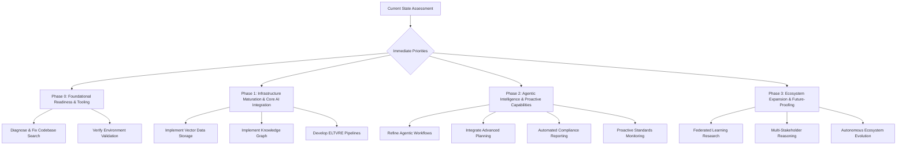

# ISA Project Strategic Development Roadmap

## 1. Current State Assessment

The Intelligent Standards Agent (ISA) project is currently in active development (version 0.1.0), aiming to understand, analyze, and generate GS1 standards. Phase 1, "Foundational Strengthening & Core Capability Enhancement," is complete, having established core RAG (Retrieval-Augmented Generation) pipelines, error detection mechanisms, and initial conceptual tools. The project is now actively engaged in Phase 2, "Infrastructure Maturation & Advanced Feature Integration," which focuses on scaling critical infrastructure components like vector data storage and the GS1 Standards Knowledge Graph, alongside implementing advanced data ingestion pipelines (ELTVRE) and sophisticated AI capabilities (e.g., KG-RAG integration, advanced LLM reasoning, multi-modal understanding).

Recent development efforts have concentrated on building out LangGraph-based agentic workflows, implementing semantic search functionalities, and integrating advanced planning and cost-benefit analysis components. The project benefits from a well-defined modular architecture and a comprehensive multi-phase roadmap extending to 2029, as detailed in `isa/context/ISA_Roadmap.md`.

**Strengths:**
*   A clear, detailed, and long-term project roadmap is in place.
*   The architecture is modular, extensible, and designed for scalability.
*   Active development is ongoing in core AI areas, including RAG, Knowledge Graph, multi-modal processing, and agentic workflows.
*   Robust internal tooling for validation, summarization, and logging supports development quality.
*   The project utilizes well-defined Roo modes for efficient task delegation.
*   There is a strong emphasis on security and compliance, with dedicated phases and audit processes.

**Weaknesses/Areas for Improvement:**
*   Scaling of vector data storage and full Knowledge Graph implementation are ongoing efforts within Phase 2.
*   Advanced AI features such as Neuro-Symbolic AI and causal inference are still in exploratory stages.
*   Formalized MLOps for continuous updates is identified as a key priority for Firebase integration in Phase 2.
*   Specific architectural documentation for critical components (Vector Data Storage, KG, ELTVRE, Data Governance, Cross-domain interoperability) has been identified as a gap in the existing roadmap.
*   The `codebase_search` tool is currently non-functional, indicating a potential issue with the underlying indexing or search infrastructure that requires immediate attention.

## 2. Immediate Priorities

Based on the current status and identified areas for improvement, the immediate priorities are:

1.  **Stabilize Core Development Tools:** Address and resolve issues with foundational tools like `codebase_search` to ensure smooth development workflows.
2.  **Complete Phase 2 Infrastructure:** Focus on the full implementation and optimization of the Vector Data Store and Knowledge Graph, along with robust ELTVRE pipelines.
3.  **Enhance Agentic Workflow Capabilities:** Continue to refine and expand the LangGraph-based PPAM cycle, integrating advanced planning and decision-making.
4.  **Initiate Proactive Capabilities:** Begin work on automated compliance reporting and early warning systems for standards evolution.

## 3. Phased Development Approach

The strategic plan will leverage the existing `ISA_Roadmap.md` and elaborate on the current and immediate next phases, structuring them to address the identified priorities.

### Phase 0: Foundational Readiness & Tooling (Current Focus)

*   **Goal:** Ensure all internal development tools (semantic search, validator, summarizer) are fully operational and the development environment is robust and reliable.
*   **Rationale:** The current `codebase_search` failure highlights a critical need to prioritize the stability and functionality of core development infrastructure before proceeding with major feature development.
*   **Key Initiatives:**
    *   Diagnose and fix the `codebase_search` index error to restore semantic search capabilities.
    *   Review and optimize existing utilities within `isa/core/` to ensure peak performance and reliability.
    *   Verify the full implementation and adherence to all global instructions related to environment validation, logging, and traceability.

### Phase 1: Infrastructure Maturation & Core AI Integration (Building on Active Phase 2)

*   **Goal:** Solidify the core data infrastructure (Vector Store, Knowledge Graph) and integrate them deeply with advanced AI reasoning capabilities.
*   **Rationale:** This phase directly aligns with the active Phase 2 of the existing `ISA_Roadmap.md` and focuses on the critical architectural components necessary for advanced AI functionalities.
*   **Key Initiatives:**
    *   Achieve full implementation and optimization of the Vector Data Storage solution.
    *   Complete the full implementation and population of the GS1 Standards Knowledge Graph.
    *   Establish deep integration between the Knowledge Graph and Vector Store with RAG and advanced LLM reasoning techniques (e.g., Chain-of-Thought, Tree-of-Thought).
    *   Develop robust ELTVRE (Extract, Load, Transform, Validate, Refine, Embed) pipelines for efficient and reliable data ingestion.

### Phase 2: Agentic Intelligence & Proactive Capabilities (Transitioning from Phase 2, leading to Phase 4/5)

*   **Goal:** Enhance ISA's autonomous capabilities through sophisticated agentic workflows and introduce proactive monitoring and analysis features.
*   **Rationale:** This phase builds upon the recently implemented LangGraph-based PPAM (Perception, Planning, Action, Memory) cycle and serves as a bridge towards the objectives outlined in Phase 4 (Enhanced Data Governance and Compliance Automation) and Phase 5 (Proactive Standards Evolution Monitoring) of the existing roadmap.
*   **Key Initiatives:**
    *   Refine and expand LangGraph-based agentic workflows to handle increasingly complex tasks autonomously.
    *   Integrate advanced planning and cost-benefit analysis components into agent decision-making processes.
    *   Begin the development of automated compliance reporting and data lineage tracking functionalities.
    *   Initiate the implementation of proactive monitoring systems for detecting and analyzing standards evolution.

### Phase 3: Ecosystem Expansion & Future-Proofing (Long-Term Vision)

*   **Goal:** Realize ISA's long-term vision as an indispensable, adaptive, and intelligent partner within the broader GS1 ecosystem, incorporating cutting-edge advancements like federated learning, multi-stakeholder reasoning, and autonomous evolution.
*   **Rationale:** This phase encompasses the later stages (Phases 8-18) of the existing `ISA_Roadmap.md`, focusing on advanced research, strategic integrations, and future-proofing the ISA platform.
*   **Key Initiatives:**
    *   Conduct exploratory research into federated learning and the establishment of a trust mesh for secure, distributed collaboration.
    *   Develop capabilities for multi-stakeholder tradeoff reasoning to facilitate consensus in complex standards discussions.
    *   Implement mechanisms for autonomous ecosystem evolution, allowing ISA to adapt and propose changes proactively.
    *   Initiate research into quantum-resistant cryptography and decentralized identity solutions to ensure long-term security and data integrity.

## 4. Initial Actionable Steps

To kickstart the development based on this strategic plan, here are some concrete initial tasks and their suggested Roo mode delegations:

*   **Task:** Investigate and resolve the `codebase_search` index error.
    *   **Mode:** `Debug`
    *   **Description:** Analyze system logs, configuration files, and the codebase search implementation to identify the root cause of the "Code index is not ready for search" error and propose a fix.

*   **Task:** Verify the implementation of runtime environment validation (checking for `.venv` activation, `.env` file presence, and `python-dotenv` installation).
    *   **Mode:** `AuditorMode`
    *   **Description:** Conduct a thorough audit of the environment validation process as per the global instructions to ensure it is robust and correctly implemented.

*   **Task:** Develop detailed architectural documentation for Vector Data Storage.
    *   **Mode:** `Architect`
    *   **Description:** Create or update `isa/architecture/vector_data_storage.md` with comprehensive technical specifications, design choices, and implementation considerations for the vector data store.

*   **Task:** Implement the core components of the ELTVRE pipeline.
    *   **Mode:** `Code`
    *   **Description:** Develop and test the foundational functions for `extractor.py`, `transformer.py`, `validator.py`, `refiner.py`, `enricher.py`, and `loader.py` within the `isa/eltvre/` directory.

*   **Task:** Design a new agentic workflow for automated compliance reporting.
    *   **Mode:** `Architect`
    *   **Description:** Define the high-level steps, required data inputs, decision points, and expected outputs for an agentic workflow that automates compliance reporting against GS1 standards.

*   **Task:** Research and prototype early warning systems for standard changes.
    *   **Mode:** `ResearchMode`
    *   **Description:** Investigate various methods and technologies (e.g., natural language processing, semantic diffing, external API integrations) for proactively detecting and analyzing semantic changes in GS1 standards documents and related regulatory landscapes.